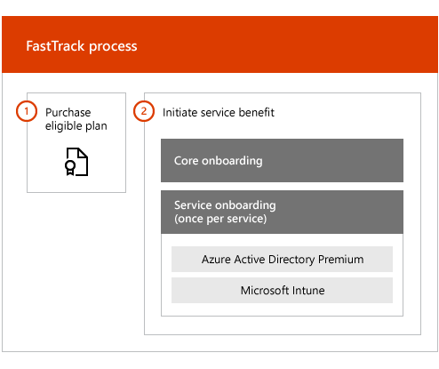

# FastTrack 센터 혜택 개요

microsoft Azure Active Directory Premium 및 microsoft Intune에 대 한 fasttrack 센터 혜택을 사용 하 여 fasttrack 전문가와 원격으로 작업 하 여 환경을 준비 하 고 조직 내에서 롤아웃 및 사용 현황을 계획 합니다. 자격에 대 한 자세한 내용을 보려면 [EMS (Enterprise Mobility + Security)에 대 한 fasttrack 센터 혜택 프로세스](EMS-fasttrack-process.md)를 참조 하세요.

온보딩은 다음 두 가지 주요 구성 요소로 이루어져 있습니다.

-   **코어 온 보 딩** -필요한 경우 테 넌 트 구성 및 Azure Active Directory와의 통합에 필요한 작업입니다. 또한 코어 온 보 딩은 온 보 딩 기타 Microsoft Online 적격 서비스에 대 한 기준을 제공 합니다.

-   **서비스 온 보 딩** -EMS 작업의 독립 실행형 변형 (Azure AD Premium 및 Intune)을 구성 하는 데 필요한 작업입니다.

다음 다이어그램에서는 fasttrack 센터 혜택에 대 한 높은 수준의 온 보 딩 단계를 설명 합니다.

프로세스의 작동 방식은 다음과 같습니다.

- fasttrack 센터는 적합 한 서비스의 라이선스를 구매한 후 온 보 딩 지원을 제공 하려는 사용자에 게 연락 하려고 합니다. 조직에 대해 이러한 서비스를 배포할 준비가 된 경우 [fasttrack 센터](https://go.microsoft.com/fwlink/?linkid=780698) 에서 지원을 요청할 수도 있습니다. 지원을 요청 하려면 회사 또는 학교 계정을 사용 하 여 [fasttrack 센터](https://go.microsoft.com/fwlink/?linkid=780698) 에 로그인 하 고, 페이지로 이동 하 여 페이지 오른쪽 아래 모서리에 있는 **도움말 보기** 링크를 확장 한 다음 화면의 지시에 따라 요청을 완료 합니다. 온 보 딩 지원이 시작 되 면 온라인 모임 일정이 설정 됩니다.

-   fasttrack 팀은 핵심 기능 (모든 Microsoft Online 서비스에 공통)을 먼저 사용 하 고 각 적합 한 서비스에 온 보 딩을 사용 하도록 도와줍니다.

모든 온 보 딩 지원은 할당 된 fasttrack 담당자가 원격으로 제공 합니다.

-   fasttrack 팀은 도구, 설명서 및 지침을 조합해 서 사용 하 여 다양 한 온 보 딩 활동을 원격으로 지원 합니다.

-   온 보 딩 지원은 fasttrack 센터에서 제공 하며, 지정 된 지역의 일반 업무 시간 동안 사용할 수 있습니다.

-   온 보 딩 지원은 중국어 번체, 중국어 간체 (리소스 읽어주기 만다린어 only), 영어, 프랑스어, 독일어, 이탈리아어, 일본어, 한국어, 포르투갈어 (브라질), 스페인어, 태국어 및 베트남어로 제공 됩니다.

-   fasttrack 팀은 사용자와 직접 또는 대리인과 작업할 수 있습니다.

> [!NOTE]
> **자세한 정보를 원하십니까?** [Enterprise Mobility + Security](https://www.microsoft.com/cloud-platform/enterprise-mobility)를 참조 하세요.

## 다음 단계

[EMS-원본 환경 기대치에 대 한 fasttrack 센터 혜택](EMS-source-environment-expectations.md)
