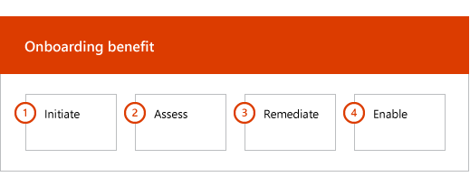

# 온 보 딩 단계

[적합 한 서비스 및 계획](M365-eligible-services-and-plans.md) 을 사용 하 여 microsoft Azure Active Directory Premium 및 microsoft Intune을 사용할 준비가 되 면 프로세스에 여러 단계가 포함 됩니다. 다음 섹션에서는 온 보 딩 프로세스의 각 단계에 대해 설명 합니다.

온 보 딩에는 다음과 같은 네 가지 기본 단계가 있습니다.

## 시작 단계

적절 한 라이선스 수를 구매한 후에는 구매 확인 전자 메일의 지침에 따라 라이선스를 기존 테 넌 트 나 새 테 넌 트에 연결 합니다. Microsoft는 fasttrack 센터 혜택에 대 한 자격을 확인 하 고 사용자에 게 온 보 딩 지원 제공을 시도 합니다.

> [!NOTE]
> 조직에 대해 이러한 서비스를 배포할 준비가 된 경우 [fasttrack 센터](https://go.microsoft.com/fwlink/?linkid=780698) 에서 지원을 요청할 수도 있습니다.

### 지원을 요청 하려면

1. [FastTrack 사이트](https://go.microsoft.com/fwlink/?linkid=780698)에 로그인합니다.
2. **FastTrack**을 선택합니다.
3. **서비스**를 선택합니다.
4. **Microsoft 365 양식에서 지원 요청**을 완료 합니다.

온보딩 지원이 시작되면 온라인 모임 일정이 설정됩니다.

> [!NOTE]
> Microsoft 파트너가 Office 365 테 넌 트에 나열 되어 있으면이 옵션이 표시 되지 않습니다. 도움이 필요 하면 Microsoft 파트너에 게 문의 하세요.

Microsoft 파트너는 고객을 대신 하 여 [fasttrack 사이트](https://go.microsoft.com/fwlink/?linkid=780698) 를 통해 도움을 얻을 수도 있습니다. 이렇게 하려면 다음을 수행 합니다.

1. [FastTrack 사이트](https://go.microsoft.com/fwlink/?linkid=780698)에 로그인합니다.
2. **FastTrack**을 선택합니다.
3. **내 고객**을 선택합니다.
4. 고객을 검색하거나 고객 목록에서 선택합니다.
5. **서비스**를 선택합니다.
6. **Microsoft 365 양식에서 지원 요청**을 완료 합니다.

온 보 딩 지원이 시작 되 면 fasttrack은 온 보 딩 프로세스를 논의 하 고, 데이터를 확인 하 고, 자동 제공 회의를 설정 하기 위해 온라인 모임 일정을 설정 합니다.

## 평가 단계

온 보 딩 프로세스가 시작 되 면 fasttrack 센터는 사용자와 함께 작동 하 여 원본 환경과 요구 사항을 평가 합니다. 도구를 실행 하 여 환경을 평가 하 고 fasttrack 전문가가 온-프레미스 Active Directory, 인터넷 브라우저, 클라이언트 장치 운영 체제, DNS (Domain Name System), 네트워크, 인프라 및 id 시스템을 평가 하는 과정을 안내 합니다. 온 보 딩에 대 한 변경이 필요한 지 확인 합니다.

fasttrack 센터는 또한 적합 한 서비스를 성공적으로 채택 하는 방법에 대 한 지침을 사용자에 게 연결 합니다.

현재 설정에 따라, EMS 또는 개별 클라우드 서비스에 대 한 성공적인 온 보 딩에 대 한 최소 요구 사항까지 원본 환경을 제공 하는 수정 계획을 사용 합니다. 또한 업데이트 관리 단계에 적합 한 검사점 호출을 설정 합니다.

## 재구성 단계
필요에 따라 각 서비스의 온 보 딩 및 채택을 위한 요구 사항을 충족 하도록 원본 환경에 대 한 재구성 계획의 작업을 수행 합니다.

사용 단계를 시작 하기 전에 먼저 재구성 작업의 결과를 공동으로 확인 하 여 계속할 준비가 되었는지 확인 합니다.

## 사용 단계
모든 재구성 작업이 완료 되 면 프로젝트는 서비스 사용을 위한 핵심 인프라 구성으로 이동 되며 각 적격 EMS 클라우드 서비스를 제공 합니다.

**사용 단계-핵심 기능**

핵심 온 보 딩에는 서비스 프로 비전 및 테 넌 트 및 id 통합이 포함 됩니다. Azure AD Premium 및 Intune과 같은 온 보 딩 온라인 서비스의 토대를 제공 하는 단계도 포함 됩니다.

> [!NOTE]
> WAP는 웹 응용 프로그램 프록시를 나타냅니다. SSL은 Secure Sockets Layer를 나타냅니다. SDS는 학교 데이터 동기화를 나타냅니다. SDS에 대한 자세한 내용은 [Microsoft 학교 데이터 동기화 시작](https://go.microsoft.com/fwlink/?linkid=871480)을 참조하세요.

> [!NOTE]
> 관리 되는 인증 방법에는이 포함 되지만 암호 해시 동기화로 제한 되지는 않습니다. id 통합은 일회성 활동 이며, 관리 또는 페더레이션 같은 기존 인증 방법의 마이그레이션 또는 폐기는 포함 하지 않습니다.

### 사용 단계-Azure AD Premium

azure ad Premium 환경은 azure active directory Connect tool 디렉터리 동기화 및 AD FS (active directory Federation Services)를 사용 하 여 설정할 수 있습니다 (필요한 경우).

온-프레미스 id를 클라우드와 동기화 하는 기능을 포함 하는 Azure ad premium 시나리오에서는 IT 관리자 및 사용자를 구독에 추가 하 고, 관리 필수 구성 요소를 구성 하 고, Azure AD Premium을 설정 하 고, 디렉터리를 설정 하는 데 도움이 됩니다 Azure ad Connect 도구를 사용 하 여 관리 되는 인증 및 AD FS와 동기화 하 고, 테스트 사용자를 구성 하 고, 서비스의 핵심 사용 사례를 확인 합니다.

Azure AD Premium 설치에는 다음과 같은 기능이 포함 되어 있습니다.

-   Azure Active Directory 셀프 서비스 암호 재설정 (SSPR)

-   azure MFA (multi-factor Authentication)

-   [Azure Active Directory Marketplace](https://azure.microsoft.com/marketplace/active-directory/)에서 sso (Single sign-on)를 사용한 SaaS (Software as a Service) 응용 프로그램 통합 (3 개 이상)

-   [앱 통합 자습서 목록](https://docs.microsoft.com/en-us/azure/active-directory/saas-apps/tutorial-list)에 나열 된 미리 통합 된 SaaS 응용 프로그램에 대 한 자동 사용자 프로 비전으로, 아웃 바운드 프로 비전 으로만 제한 됩니다.

-   로고, 텍스트 및 이미지를 포함 하는 사용자 지정 된 로그온 화면

-   셀프 서비스 및 동적 그룹 (그룹)

-   Azure Active Directory 응용 프로그램 프록시

-   Azure Active Directory Connect Health입니다.

-   Azure Active Directory 조건부 액세스

-   Azure Active Directory 사용 약관

-   Azure Active Directory id 보호

-   Azure Active Directory 권한 있는 id 관리

-   Azure Active Directory 액세스 검토

### 사용 단계-Intune

Intune에서는 Microsoft intune을 사용 하 여 장치를 관리할 수 있도록 준비를 안내 합니다. 정확한 단계는 원본 환경에 따라 다르며 모바일 장치 및 모바일 앱 관리 요구 사항을 기반으로 합니다. 이 단계에는 다음이 포함 될 수 있습니다.

-   최종 사용자에 게 라이선스를 부여 합니다. 또한 필요한 경우 Microsoft 클라우드 서비스 테 넌 트에 대 한 볼륨 라이선스를 활성화 하는 방법에 대 한 지원을 제공 합니다.

-   온-프레미스 Active Directory 또는 클라우드 id를 활용 하 여 Intune에서 사용할 id 구성

-   Intune 구독에 사용자 추가, IT 관리자 역할 정의, 사용자 및 장치 그룹 만들기

-   다음을 포함 하 여 관리 요구 사항에 따라 MDM (모바일 장치 관리) 권한 구성

    -   intune이 유일한 mdm 솔루션 이거나 Office 365에 대 한 모바일 장치 관리와 함께 사용 되는 경우 intune을 MDM 기관으로 설정 합니다.

-   다음에 대 한 MDM 지침 제공:

    -   MDM 관리 정책의 유효성을 검사 하는 데 사용할 테스트 그룹 구성

    -   다음과 같은 MDM 관리 정책 및 서비스 구성

        -   웹 링크 또는 딥 링크를 통해 지원 되는 각 플랫폼용 응용 프로그램 배포

        -   조건부 액세스 정책

        -   조직의 기존 인증 기관, wi-fi 또는 vpn 인프라를 사용 하는 경우 전자 메일, 무선 네트워크 및 vpn (가상 사설망) 프로필 배포

        -   Microsoft Intune Exchange Connector를 설정 하는 경우 (해당 하는 경우)

        -   Intune 데이터 웨어하우스에 연결

        -   Intune을 다음에 통합:
            -   team viewer for remote 지원 (team viewer 구독이 필요 함)

            -   MTD (모바일 위협 방어) 파트너 솔루션 (모바일 위협 방어 subcription 필요)

            -   텔레콤 경비 관리 솔루션 (텔레콤 경비 관리 솔루션 구독이 필요 함).

            -   windows Defender Advanced Threat Protection (windows E5 또는 Microsoft 365 E5 라이선스가 필요 함).

    -   [지원 되](https://technet.microsoft.com/library/dn600287.aspx) 는 각 플랫폼의 장치를 Intune으로 등록

-   앱 보호 지침 제공:

    -   지원 되는 각 플랫폼에 대해 앱 보호 정책 구성

    -   관리 되는 앱에 대 한 조건부 액세스 정책 구성

    -   위의 MAM 정책을 사용 하 여 적절 한 사용자 그룹을 대상으로 지정 합니다.

    -   관리 되는 응용 프로그램 사용 보고서 사용

-   PC 관리 지침 제공:

    -   Intune 클라이언트 소프트웨어 설치 (필요한 경우)

    -   Intune에서 사용 가능한 소프트웨어 및 하드웨어 보고서 사용

    > [!IMPORTANT]
    > fasttrack은 Intune을 사용 하 여 Windows 10 클래식 PC 관리를 지원 하지 않습니다. fasttrack은 Intune MDM (모바일 장치 관리)을 통해서만 Windows 10 장치 관리를 지원 합니다.

#### Windows Autopilot

fasttrack은 장치에 사용자 지정 운영 체제 이미지를 작성, 유지 관리 및 적용할 필요 없이 최종 사용자에 게 새 장치를 제공 하 여 Windows Autopilot 및 Intune과의 장치 프로 비전을 간소화 하는 데 도움이 됩니다.

fasttrack은 다음과 같은 Autopilot 시나리오를 지원 합니다.

- **Azure AD 셀프 서비스:** 장치 Azure AD에 가입 하 고 Intune에 등록 합니다. 이 시나리오는 Windows 10 1703 및 최신 버전을 사용 하는 경우 지원 됩니다.

- **Hybrid AAD 셀프 서비스:** 장치는 온-프레미스 ad 및 Azure AD에 연결 하 고 Intune에 등록 합니다. 이 시나리오는 Windows 10 1809 및 최신 버전을 사용 하는 경우 지원 됩니다.

- **자체 프로 비전:** 장치가 Azure AD를 자동으로 연결 합니다. 이 시나리오는 Windows 1809 및 최신 버전을 사용 하는 경우 지원 됩니다.

    > [!IMPORTANT]
    > fasttrack은 Configuration Manager에서 시작 된 Autopilot 시나리오를 지원 하지 않습니다.

Windows Autopilot을 설치 하는 단계는 원본 환경에 따라 다르며 다음을 포함할 수 있습니다.

- Windows Autopilot 용 Microsoft Intune을 구성 하 고 설치 합니다.

- Azure AD 동적 그룹 구성

- Azure AD에 회사 브랜딩을 추가 합니다.

- windows Autopilot 프로필 (예: 로컬 관리자 계정 만들기를 제한 하는 windows Autopilot 프로필)에 디바이스를 만들고 할당 합니다.

- OOBE (기본 사용 환경)를 사용자 지정 하 여 조직의 요구 사항을 준수 합니다.

- Azure AD 및 Intune에서 MDM 자동 등록을 구성 합니다.

#### 안전 하 게 iOS 및 Android 용 Outlook 배포

fasttrack은 사용자에 게 필요한 앱이 모두 설치 되도록 조직에서 iOS 및 Android 용 Outlook을 안전 하 게 배포 하는 데 도움이 됩니다.

Intune을 사용 하 여 iOS 및 Android 용 Outlook Mobile을 안전 하 게 배포 하는 단계는 원본 환경에 따라 다음을 포함할 수 있습니다.

- Apple app store 또는 Google Play 스토어를 통해 iOS 및 Android 용 Outlook, Microsoft 인증자 및 Intune 회사 포털 앱을 다운로드 합니다.
- 또한 설정에 대 한 지침을 제공 합니다.
    - intune을 사용 하는 iOS 및 Android 용 Outlook, Microsoft 인증자 및 intune 회사 포털 앱 배포
    - 앱 보호 정책
    - 조건부 액세스 정책
    - 앱 구성 정책

    > [!IMPORTANT]
    > fasttrack 팀은 Exchange 모바일 장치 사서함 정책을 사용 하 여 iOS 및 Android 용 Outlook 보안을 지원 하지 않습니다.

#### 공동 관리

fasttrack은 구성 관리자와 Intune을 모두 사용 하 여 Windows 10 장치를 동시에 관리할 수 있도록 준비 하는 과정을 안내 합니다. 정확한 단계는 원본 환경에 따라 다르며 다음을 포함할 수 있습니다.

- 공동 관리의 이점을 설명 합니다.

- 최종 사용자에 게 라이선스를 사용 합니다. fasttrack은 또한 필요에 따라 Microsoft 클라우드 서비스 테 넌 트에 대 한 볼륨 라이선스를 활성화 하는 방법에 대 한 지원을 제공 합니다.

- 온-프레미스 Active Directory 및/또는 클라우드 id를 활용 하 여 Intune에서 사용할 id를 구성 합니다.

- Intune 구독에 사용자 추가, IT 관리자 역할 정의, 사용자 및 장치 그룹 만들기

- 하이브리드 (System Center Configuration Manager)와 통합 된 intune에서 intune 독립 실행형으로 이동 하는 방법에 대 한 지침을 제공 합니다.

- MDM 자동 등록에 대 한 Azure Active Directory 설정에 대 한 지침을 제공 합니다.

- 하이브리드 Azure Active Directory 조인의 설정 지침을 제공 합니다.

- 클라우드 관리 게이트웨이를 설정 하는 방법에 대 한 지침을 제공 합니다.

- Configuration Manager 콘솔에서 공동 관리를 사용 하도록 설정 합니다.

- Intune으로 전환 하려는 지원 되는 작업을 구성 합니다.

- Intune 등록 장치에 Configuration Manager 클라이언트를 설치 합니다.

- 사용자 환경에서 공동 관리 활동을 모니터링 하는 방법에 대 한 지침을 제공 합니다.

fasttrack은 또한 적합 한 서비스의 성공적인 채택을 유도 하는 방법에 대 한 지침을 제공 합니다.

> [!NOTE]
> **자세한 정보를 원하십니까?** [Enterprise Mobility + Security](https://www.microsoft.com/en-us/cloud-platform/enterprise-mobility)를 참조 하세요.

## 다음 단계

[EMS-Microsoft의 책임에 대 한 fasttrack 혜택](EMS-fasttrack-responsibilities.md)
