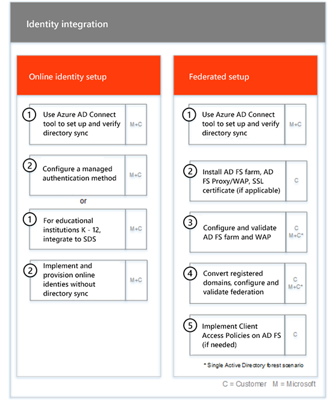

# 온보딩 단계Onboarding Phases

[적합한 서비스와 요금제](M365-eligible-services-and-plans.md)를 사용하여 Microsoft Azure Active Directory Premium, Microsoft Intune 및 Azure Information Protection을 사용할 준비가 되면 프로세스에 관련된 여러 단계가 있습니다.When you use the [Eligible Services and Plans](M365-eligible-services-and-plans.md) to get Microsoft Azure Active Directory Premium, Microsoft Intune, and Azure Information Protection ready for use, there are several phases involved in the process. 다음 섹션에서는 온보딩 프로세스의 각 단계에 대해 설명합니다.The following sections describe each phase of the onboarding process.

온보딩에는 다음과 같은 4가지 기본 단계가 있습니다.Onboarding has four primary phases:

## 시작 단계Initiate phase

적절한 수의 라이선스를 구매한 후에는 구매 확인 전자 메일의 지침에 따라 라이선스를 기존 테넌트나 새 테넌트에 연결합니다.After you purchase the appropriate number and types of licenses, follow the guidance from the purchase confirmation email to associate the licenses to your existing or new tenant. 그런 다음 Microsoft는 FastTrack Center Benefit에 대한 사용자의 자격 여부를 확인하고 사용자에게 연락하여 온보딩 지원 서비스를 제공하려고 시도합니다.Microsoft then verifies your eligibility for the FastTrack Center Benefit and tries to contact you to offer onboarding assistance.

> [!NOTE]
> 조직에 대해 이러한 서비스를 배포할 준비가 된 경우 [FastTrack 센터](https://go.microsoft.com/fwlink/?linkid=780698)에서 지원을 요청할 수도 있습니다.You can also request assistance from the [FastTrack Center](https://go.microsoft.com/fwlink/?linkid=780698) if you're ready to deploy these services for your organization.

### 도움을 요청하려면To request assistance

1. [FastTrack 사이트](https://go.microsoft.com/fwlink/?linkid=780698)에 로그인합니다.Sign in to the [FastTrack site](https://go.microsoft.com/fwlink/?linkid=780698).
2. **FastTrack**을 선택합니다.Select **FastTrack**.
3. **서비스**를 선택합니다.Select **Services**.
4. **Microsoft 365 지원 요청** 양식을 완료합니다.Complete the **Request for Assistance with Microsoft 365** form.

온보딩 지원이 시작되면 온라인 모임 일정이 설정됩니다.Once onboarding assistance starts, we set up a schedule of online meetings.

> [!NOTE]
> Microsoft 파트너가 Office 365 테넌트에 포함되는 경우 이 옵션이 표시되지 않습니다.If you have a partner listed in your Office 365 tenant, you won't see this option. Microsoft 파트너에게 지원을 요청하세요.Please consult your partner for assistance.

Microsoft 파트너는 고객 대신 [FastTrack 사이트](https://go.microsoft.com/fwlink/?linkid=780698)를 통해 도움을 얻을 수도 있습니다.Partners can also get help through the [FastTrack site](https://go.microsoft.com/fwlink/?linkid=780698) on behalf of a customer. 방법은 다음과 같습니다.To do so:

1. [FastTrack 사이트](https://go.microsoft.com/fwlink/?linkid=780698)에 로그인합니다.Sign in to the [FastTrack site](https://go.microsoft.com/fwlink/?linkid=780698).
2. **FastTrack**을 선택합니다.Select **FastTrack**.
3. **내 고객**을 선택합니다.Select **My Customers**.
4. 고객을 검색하거나 고객 목록에서 선택합니다.Search for your customer or select them from your customer list.
5. **서비스**를 선택합니다.Select **Services**.
6. **Microsoft 365 지원 요청** 양식을 완료합니다.Complete the **Request for Assistance with Microsoft 365** form.

온보딩 지원이 시작되면 FastTrack은 온라인 모임 일정을 설정하여 온보딩 프로세스에 대해 논의하고 데이터를 확인하며 시작 회의를 설정합니다.Once the onboarding support starts, FastTrack sets up a schedule of online meetings with you to discuss the onboarding process, verify data, and set up a kick-off meeting.

## 평가 단계Assess phase

온보딩 프로세스가 시작되면 FastTrack 센터는 사용자와 협력하여 원본 환경과 요구 사항을 평가합니다.Once the onboarding process begins, the FastTrack Center works with you to assess your source environment and the requirements. 도구는 환경을 평가하기 위해 실행되며, FastTrack 전문가는 온-프레미스 Active Directory, 인터넷 브라우저, 클라이언트 장치의 운영 체제, DNS(Domain Name System), 네트워크, 인프라 및 ID 시스템을 평가하도록 안내하여 온보딩에 변경이 필요한지 확인할 수 있도록 합니다.Tools are run to assess your environment, and FastTrack Specialists guide you through assessing your on-premises Active Directory, Internet browsers, client devices' operating systems, Domain Name System (DNS), network, infrastructure, and identity system to determine if any changes are required for onboarding.

FastTrack 센터는 적합한 서비스를 성공적으로 채택하도록 지원하는 방법에 대한 지침을 제공합니다.The FastTrack Center also connects you with guidance about how to drive successful adoption of the eligible services.

현재 설정에 따라 EMS 또는 개별 클라우드 서비스에 대한 성공적인 온보딩을 위한 최소 요구 사항까지 원본 환경을 개선하는 재구성 계획을 제공합니다.Based on your current setup, we provide a remediation plan that brings your source environment up to the minimum requirements for successful onboarding to O365_W14_2nd and, if needed, for successful mailbox and/or data migration. 또한 재구성 단계에 적합한 검사점 통화도 설정합니다.We also set up appropriate checkpoint calls for the Remediate phase.

## 재구성 단계Remediate phase
필요한 경우 원본 환경에 대한 재구성 계획의 작업을 수행하여 각 서비스의 온보딩 및 채택을 위한 요구 사항을 충족합니다.You perform the tasks in the remediation plan on your source environment so that you meet the requirements for onboarding and adopting each service (as needed).

사용 단계를 시작하기 전에 먼저 재구성 작업의 결과를 함께 확인하여 계속할 준비가 되었는지 알아봅니다.Before beginning the Enable phase, we jointly verify the outcomes of the remediation activities to make sure you’re ready to proceed.

## 사용 단계Enable phase
모든 재구성 작업이 완료되면 프로젝트는 서비스 사용을 위한 핵심 인프라 구성에서 각 적합한 EMS 클라우드 서비스 프로비전으로 전환됩니다.When all remediation activities are complete, the focus shifts to configuring the core infrastructure for service consumption, provisioning O365_W14_2nd, and conducting the activities to drive service adoption.

**사용 단계 - 핵심 기능****Enable phase - Core capabilities**

핵심 온보딩에는 서비스 프로비전과 테넌트 및 ID 통합이 포함됩니다.Core onboarding involves service provisioning and tenant and identity integration. Azure AD Premium, Intune 및 Azure Information Protection과 같은 온보딩 온라인 서비스를위한 기반을 제공하는 단계도 포함됩니다.It also includes steps for providing a foundation for onboarding online services like Azure AD Premium, Intune, and Azure Information Protection.

> [!NOTE]
> WAP는 웹 응용 프로그램 프록시를 나타냅니다. SSL은 Secure Sockets Layer를 나타냅니다. SDS는 학교 데이터 동기화를 나타냅니다. SDS에 대한 자세한 내용은 [Microsoft 학교 데이터 동기화 시작](https://go.microsoft.com/fwlink/?linkid=871480)을 참조하세요.WAP stands for Web Application Proxy. SSL stands for Secure Sockets Layer. SDS stands for School Data Sync. For more information on SDS, see [Welcome to Microsoft School Data Sync](https://go.microsoft.com/fwlink/?linkid=871480).

> [!NOTE]
> 관리 인증 방법에는 암호 해시 동기화가 포함되지만 이에 국한되지는 않습니다.A managed authentication method includes, but is not limited to password hash synchronization. ID 통합은 일회성 활동이며 관리 또는 페더레이션과 같은 기존 인증 방법의 마이그레이션 또는 서비스 해제는 포함되지 않습니다.Identity integration is a one time activity and does not include migrating or decommissioning of existing authentication methods, such as managed or federated.

### 사용 단계 - Azure AD PremiumEnable phase - Azure AD Premium

Azure AD Premium 환경은 Azure Active Directory Connect 도구 디렉터리 동기화와 AD FS(Active Directory Federation Service)를 사용하여 설정할 수 있습니다(필요에 따라).The Azure AD Premium environment can be set up by using the Azure Active Directory Connect tool directory synchronization and Active Directory Federation Services (AD FS) (as needed).

온-프레미스 ID를 클라우드에 동기화하는 것을 포함하는 Azure AD Premium 시나리오의 경우, IT 관리자와 사용자를 구독에 추가하고, 관리 필수 구성 요소를 구성하고, Azure AD Premium을 설정하고, Azure AD Connect 도구를 사용하여 관리 인증 및 AD FS와의 디렉터리 동기화를 설정하고, 테스트 사용자를 구성하고, 서비스에 대한 핵심 사용 사례를 확인합니다.For Azure AD Premium scenarios that include synchronizing on-premises identities to the cloud, we help you by adding IT admins and users to your subscription, configuring management prerequisites, setting up Azure AD Premium, setting up directory synchronization with managed authentication and AD FS using the Azure AD Connect tool, configuring test users, and validating your core use cases for the service.

Azure AD Premium 설정에는 다음 기능이 포함됩니다.Azure AD Premium setup includes enabling the following features:

-   Azure Active Directory 셀프 서비스 암호 재설정(SSPR)Azure Active Directory Self-Service Password Reset (SSPR).

-   Aure MFA(Azure 다단계 인증).Azure Multi-Factor Authentication (Azure MFA).

-   [Azure Active Directory 마켓플레이스](https://azure.microsoft.com/marketplace/active-directory/)에서 SSO(Single Sign-On)를 사용하여 최대 세 개 이상의 SaaS(Software as a Service) 응용 프로그램 통합Up to three (3) or more Software as a Service (SaaS) application integrations with Single Sign-On (SSO) from the [Azure Active Directory Marketplace](https://azure.microsoft.com/marketplace/active-directory/).

-   
  [앱 통합 자습서 목록](https://docs.microsoft.com/ko-KR/azure/active-directory/saas-apps/tutorial-list)에 열거된 사전 통합된 SaaS 응용 프로그램에 대한 자동 사용자 프로비저닝(아웃바운드 프로비저닝으로만 제한됨)Automatic user provisioning for pre-integrated SaaS applications as listed in the [App integration tutorial list](https://docs.microsoft.com/en-us/azure/active-directory/saas-apps/tutorial-list), limited to outbound provisioning only.

-   사용자 지정된 로그 화면(로고, 텍스트, 이미지 포함)Customized logon screen, including logo, text, and images.

-   셀프 서비스 및 동적 그룹(그룹)Self-Service and Dynamic Groups (Groups).

-   Azure Active Directory 응용 프로그램 프록시Azure Active Directory Application Proxy.

-   Azure Active Directory Connect 상태Azure Active Directory Connect

-   Azure Active Directory 조건부 액세스Azure Active Directory Conditional Access

-   Azure Active Directory 사용 약관Azure Active Directory Terms of Use.

-   Azure Active Directory ID 보호Azure Active Directory Identity Protection.

-   Azure Active Directory Privileged Identity ManagementAzure Active Directory Privileged Identity Management.

-   Azure Active Directory 액세스 검토Azure Active Directory Conditional Access

### 사용 단계 - IntuneEnable phase - Intune

Intune에서 장치를 관리하는 데 Microsoft Intune을 사용할 수 있도록 준비하는 과정을 안내합니다.For Intune, we guide you through getting ready to use Microsoft Intune to manage devices. 정확한 단계는 원본 환경에 따라 다르며 모바일 장치와 모바일 앱 관리 요구 사항에 기반합니다.The exact steps depend on your source environment and are based on your mobile device and mobile app management needs. 해당 단계는 다음과 같습니다.The steps can include:

-   최종 사용자에게 라이선스 부여Licensing your end users. Microsoft 클라우드 서비스 사용자(필요한 경우)의 볼륨 라이선스를 활성화하는 방법에 대한 지원도 제공합니다.We also provide assistance on how to activate volume licenses for your Microsoft cloud service tenant (as needed).

-   온-프레미스 Active Directory 또는 클라우드 ID를 활용하여 Intune에서 사용할 ID 구성Configuring identities to be used by Intune by leveraging either your on-premises Active Directory or cloud identities.

-   Intune 구독에 사용자 추가, IT 관리자 역할 정의, 사용자 및 장치 그룹 만들기Adding users to your Intune subscription, defining IT admin roles, and creating user and device groups.

-   다음을 비롯한 관리 요구 사항에 따라 MDM(모바일 장치 관리) 기관 구성Configuring your Mobile Device Management (MDM) authority, based on your management needs, including:

    -   Intune이 유일한 MDM 솔루션이거나 Office 365의 모바일 장치 관리와 함께 사용되는 경우 Intune을 MDM 기관으로 설정합니다.Setting Intune as your MDM authority when Intune is your only MDM solution or is in conjunction with Mobile Device Management for Office 365.

-   MDM 지침 제공:Providing MDM guidance for:

    -   MDM 관리 정책의 유효성을 검사하는 데 사용할 테스트 그룹 구성Configuring tests groups to be used to validate MDM management policies.

    -   다음과 같은 MDM 관리 정책 및 서비스 구성Configuring MDM management policies and services like:

        -   웹 링크 또는 딥 링크를 통해 지원되는 각 플랫폼용 응용 프로그램 배포Application deployment for each supported platform through web links or deep links.

        -   조건부 액세스 정책.Conditional access policies for identity

        -   조직에서 기존 인증 기관, Wi-Fi 또는 VPN 인프라를 보유하고 있는 경우 전자 메일, 무선 네트워크, VPN(가상 사설망) 프로필 배포Deployment of email, wireless networks, and virtual private network (VPN) profiles if you have an existing  certificate authority, Wi-Fi or VPN infrastructure in your organization.

        -   Microsoft Intune Exchange Connector 설정(해당하는 경우)Setting up the Microsoft Intune Exchange Connector (when applicable).

        -   Intune 데이터 웨어하우스에 연결Connecting to Intune Data Warehouse

        -   다음에 Intune 통합:Integrating Intune with:
            -   원격 지원을 위한 팀 뷰어(팀 뷰어 구독 필수)Team Viewer for remote assistance (Team viewer subscription is required).

            -   MTD(Mobile Threat Defense) 파트너 솔루션(Mobile Threat Defense 파트너 솔루션 구독 필수)Mobile Threat Defense (MTD) partner solutions (Mobile Threat Defense subcription is required).

            -   Telecom Expense Management 솔루션(Telecom Expense Management 구독 필수)Telecom expense management solution (Telecom expense management solution subscription is required).

            -   Windows Defender Advanced Threat Protection(Windows E5 또는 Microsoft 365 E5 라이선스 필요)Windows Defender Advanced Threat Protection (Windows E5 or Microsoft 365 E5 licenses are required).

    -   각 [지원되는 플랫폼](https://technet.microsoft.com/library/dn600287.aspx)의 장치를 Intune에 등록합니다.Enrolling devices of each [supported platform](https://technet.microsoft.com/library/dn600287.aspx) to Intune.

-   앱 보호 지침 제공:Providing App Protection guidance on:

    -   지원되는 각 플랫폼에 대한 Intune 앱 보호 정책 구성Configuring app protection policies for each supported platform.

    -   관리되는 앱에 대한 조건부 액세스 정책 구성Configuring conditional access policies for managed apps.

    -   위의 MAM 정책을 사용하여 적절한 사용자 그룹을 대상으로 지정Targeting the appropriate user groups with the above MAM policies.

    -   관리 응용 프로그램 사용 현황 보고서 사용Using managed-applications usage reports.

-   PC 관리 지침 제공Providing PC management guidance on:

    -   필요한 경우 Intune 클라이언트 소프트웨어 설치Installing the Intune client software (when needed).

    -   Intune에서 사용할 수 있는 소프트웨어 및 하드웨어 보고서 사용Using the software and hardware reports available in Intune.

    > [!IMPORTANT]
    > FastTrack은 Intune을 통한 Windows 10 클래식 PC 관리를 지원하지 않습니다.FastTrack does not support Windows 10 classic PC management with Intune. FastTrack은 Intune MDM(모바일 장치 관리)를 통한 Windows 10 장치 관리만 지원합니다.FastTrack only supports Windows 10 device management through Intune mobile device management (MDM).

#### Windows AutopilotWindows Autopilot

FastTrack은 장치에 사용자 지정 운영 체제 이미지를 작성, 유지 관리 및 적용할 필요 없이 최종 사용자에게 새로운 장치를 제공하여 Windows Autopilot 및 Intune으로 장치 프로비저닝을 단순화하는 데 도움을 줄 수 있습니다.FastTrack can help you through simplifying your device provisioning with Windows Autopilot and Intune by giving new devices to your end users without the need to build, maintain and apply custom operating system images to your devices.

FastTrack은 다음과 같은 Autopilot 시나리오를 지원합니다.FastTrack supports the following Autopilot scenarios:

- **Azure AD 셀프 서비스:** 장치는 Azure AD에 가입하고 Intune에 등록합니다.**Azure AD self-service:** Devices join Azure AD and enroll into Intune. 이 시나리오는 Windows 10 1703 및 최신 버전을 사용하는 경우 지원됩니다.This scenario is supported when using Windows 10 1703 and latest versions.

- **Hybrid AAD 셀프 서비스:** 장치가 온-프레미스 AD와 Azure AD에 모두 가입하고 Intune에 등록합니다.**Hybrid AAD self-service:** Devices join both on-premises AD and Azure AD and enroll into Intune. 이 시나리오는 Windows 10 1809 및 최신 버전을 사용하는 경우 지원됩니다.This scenario is supported when using Windows 10 1809 and latest versions.

- **셀프 프로비전:** 장치가 Azure AD에 자동으로 가입됩니다.**Self-provisioning:** Devices automatically join Azure AD. 이 시나리오는 Windows 1809 및 최신 버전을 사용하는 경우 지원됩니다.This scenario is supported when using Windows 1809 and latest versions.

    > [!IMPORTANT]
    > FastTrack은 Configuration Manager에서 시작한 Autopilot 시나리오를 지원하지 않습니다.FastTrack does not support Autopilot scenarios initiated from Configuration Manager.

Windows Autopilot를 설정하는 단계에는 원본 환경에 따라 다음이 포함될 수 있습니다.The steps to setup Windows Autopilot depends on your source environment and it can include:

- Windows Autopilot용 Microsoft Intune을 구성하고 설정합니다.Configure and setup Microsoft Intune for Windows Autopilot.

- Azure AD 동적 그룹 구성Configure Azure AD dynamic groups

- Azure AD에 회사 브랜드를 추가합니다.Add your Company branding into Azure AD.

- 장치를 만든 후 Windows Autopilot 프로필(예: 로컬 관리자 계정 만들기를 제한하는 Windows Autopilot 프로필)에 할당합니다.Create and assign devices to Windows Autopilot profiles (e.g a Windows Autopilot profile that restricts Local Administrator account creation).

- 조직의 요구 사항을 준수하도록 OOBE(Out-of-Box-Experience)를 사용자 지정합니다.Customize the Out-of-box-experience (OOBE) to comply with organization's requirements.

- Azure AD 및 Intune에서 MDM 자동 등록 구성Configuring MDM Auto-enrollment in Azure AD and Intune.

#### iOS 및 Android용 Outlook을 안전하게 배포Outlook for iOS and Android

FastTrack은 iOS 및 Android용 Outlook을 조직에 안전하게 배포하여 사용자가 필요한 모든 앱을 설치하도록 보장합니다.FastTrack can help you by deploying Outlook for iOS and Android securely in your organization to ensure your users have all the required apps installed.

Intune을 사용하여 iOS 및 Android용 Outlook Mobile을 안전하게 배포하는 단계에는 원본 환경에 따라 다음이 포함될 수 있습니다.The steps to securely deploy Outlook Mobile for iOS and Android with Intune depends on your source environment and it can include:

- iOS 및 Android용 Outlook, Microsoft Authenticator 및 Intune Company 포털 앱을 Apple App Store 또는 Google Play 스토어에서 다운로드합니다.Download Outlook for iOS and Android, Microsoft Authenticator and the Intune Company portal app via the Apple App Store or Google Play Store.
- 또한 설정에 대한 지침을 제공합니다.Also provide guidance on setting up:
    - Intune을 사용한 iOS 및 Android용 Outlook, Microsoft Authenticator 및 Intune Company 포털 앱 배포Outlook for iOS and Android, Microsoft Authenticator and the Intune Company portal app deployment with Intune.
    - 앱 보호 정책App protection policies
    - 조건부 액세스 정책Conditional access policies for identity
    - 앱 구성 정책App configuration policies

    > [!IMPORTANT]
    > FastTrack 팀은 Exchange 모바일 장치 사서함 정책을 사용하여 iOS 및 Android용 Outlook 보안을 지원하지 않습니다.FastTrack team does not support securing Outlook for iOS and Android with Exchange mobile device mailbox policies.

#### 공동 관리Co-management

FastTrack은 Configuration Manager와 Intune을 사용하여 Windows 10 장치를 동시에 관리할 수 있도록 도와줍니다.FastTrack guides you through getting ready to concurrently manage Windows 10 devices with both Configuration Manager and Intune. 정확한 단계는 원본 환경에 따라 달라지며, 다음이 포함될 수 있습니다.The exact steps depend on your source environment, and it can include:

- 공동 관리의 이점에 대한 설명Explain the benefits of Co-management.

- 최종 사용자에게 라이선스 부여License your end users. FastTrack은 Microsoft 클라우드 서비스 테넌트(필요한 경우)의 볼륨 라이선스를 활성화하는 방법에 대한 지원도 제공합니다.FastTrack also provides assistance on how to activate volume licenses for your Microsoft cloud service tenant (as needed).

- 온-프레미스 Active Directory 및/또는 클라우드 ID를 활용하여 Intune에서 사용할 ID 구성Configure identities to be used by Intune by leveraging either your on-premises Active Directory and/or cloud identities.

- Intune 구독에 사용자 추가, IT 관리자 역할 정의, 사용자 및 장치 그룹 만들기Adding users to your Intune subscription, defining IT admin roles, and creating user and device groups.

- 하이브리드(System Center Configuration Manager)와 통합된 Intune에서 Intune 독립 실행형으로 이동하는 방법에 대한 지침 제공Provide guidance on how to move from Intune integrated with System Center Configuration Manager (Hybrid) to Intune Standalone.

- MDM 자동 등록을 위해 Azure Active Directory 설정하는 방법에 대한 지침 제공Provide guidance on setting up Azure Active Directory for MDM auto-enrollment.

- 하이브리드 Azure Active Directory 참가를 설정하는 방법에 대한 지침 제공Provide guidance setting up hybrid Azure Active Directory Join.

- 클라우드 관리 게이트웨이를 설정하는 방법에 대한 지침을 제공Provide guidance on how to set up Cloud Management Gateway

- Configuration Manager 콘솔에서 공동 관리를 사용하도록 설정Enable Co-management in Configuration Manager console.

- Intune으로 전환할 지원되는 작업 부하를 구성Configure supported workloads that you want to switch to Intune.

- Intune에 등록된 장치에 Configuration Manager 클라이언트를 설치합니다.Install Configuration Manager client in Intune enrolled devices.

- 환경에서 공동 관리 활동을 모니터링하는 방법에 대한 지침을 제공Provide guidance on how to monitor the Co-management activity in your environment.

FastTrack은 또한 적합한 서비스를 성공적으로 채택하도록 지원하는 방법에 대한 지침을 제공합니다.FastTrack also provides you guidance on how to drive successful adoption of the eligible services.

#### 사용 단계 - Azure Information ProtectionEnable phase – Azure Information Protection

고객에게는 다음을 하는 방법에 대한 지침이 제공됩니다.Customers are provided guidance on how to: 

- 테넌트를 활성화하고 구성하기Activate and configure their tenant.
- 레이블과 정책을 만들고 설정하기Create and set up labels and policies.
- 문서에 정보 보호 적용하기Apply information protection to documents. 
- Azure Information Protection 클라이언트를 사용하여 Windows에서 실행 중인 Office 앱(Word, PowerPoint, Excel, Outlook 등)에서 자동으로 정보 분류 및 레이블 지정하기Automatically classify and label information in Office apps (like Word, PowerPoint, Excel, and Outlook) running on Windows and using the Azure Information Protection client.
- Azure Information Protection 스캐너를 사용하여 보관 중인 파일 사용하기Use files at rest using the Azure Information Protection scanner.
- Exchange Online 메일 흐름 규칙을 사용하여 전송 중인 전자 메일 모니터링하기Monitor emails in transit using Exchange Online mail flow rules.

Microsoft Azure RMS(권한 관리 서비스), OME(Office 365 메시지 암호화) 및 DLP(데이터 손실 방지)를 사용하여 보호를 적용하려는 고객에게도 지침이 제공됩니다.Guidance is also provided to customers who want to apply protection using Microsoft Azure Rights Management Services (Azure RMS), Office 365 Message Encryption (OME), and data loss prevention (DLP).

> [!NOTE]
> **추가 정보가 필요하십니까?** [Enterprise Mobility + Security](https://www.microsoft.com/en-us/cloud-platform/enterprise-mobility)를 참조하세요.**Want to learn more?** see [Enterprise Mobility + Security](https://www.microsoft.com/en-us/cloud-platform/enterprise-mobility).

## 다음 단계Next steps

[EMS용 FastTrack 혜택 - Microsoft 책임FastTrack benefit for EMS - Microsoft responsibilities](EMS-fasttrack-responsibilities.md)
