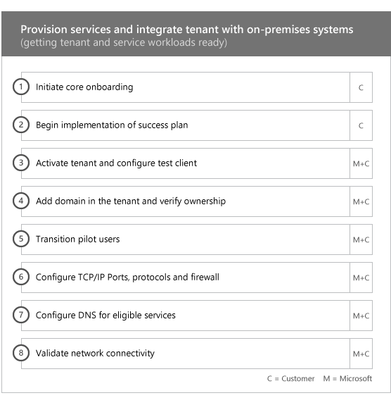
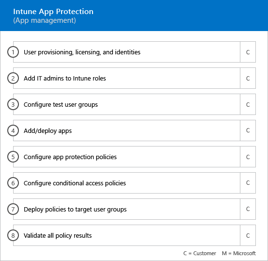

# 온 보 딩 단계Onboarding Phases

[적합 한 서비스 및 계획](M365-eligible-services-and-plans.md) 을 사용 하 여 microsoft Azure Active Directory Premium 및 microsoft Intune을 사용할 준비가 되 면 프로세스에 여러 단계가 포함 됩니다. 다음 섹션에서는 온 보 딩 프로세스의 각 단계에 대해 설명 합니다.When you use the [Eligible Services and Plans](M365-eligible-services-and-plans.md) to get Microsoft Azure Active Directory Premium and Microsoft Intune ready for use, there are several phases involved in the process. The following sections describe each phase of the onboarding process.

온 보 딩에는 다음과 같은 네 가지 기본 단계가 있습니다.Onboarding has four primary phases:

## 시작 단계Initiate phase

적절 한 라이선스 수를 구매한 후에는 구매 확인 전자 메일의 지침에 따라 라이선스를 기존 테 넌 트 나 새 테 넌 트에 연결 합니다. Microsoft는 fasttrack 센터 혜택에 대 한 자격을 확인 하 고 사용자에 게 온 보 딩 지원 제공을 시도 합니다.After you purchase the appropriate number of licenses, follow the guidance from the purchase confirmation email to associate the licenses to your existing tenant or new tenant. Microsoft then verifies your eligibility for the FastTrack Center Benefit and tries to contact you to offer onboarding assistance.

> [!NOTE]
> 조직에 대해 이러한 서비스를 배포할 준비가 된 경우 [fasttrack 센터](https://go.microsoft.com/fwlink/?linkid=780698) 에서 지원을 요청할 수도 있습니다.You can also request assistance from the [FastTrack Center](https://go.microsoft.com/fwlink/?linkid=780698) if you're ready to deploy these services for your organization.

### 지원을 요청 하려면To request assistance

1. [FastTrack 사이트](https://go.microsoft.com/fwlink/?linkid=780698)에 로그인합니다.Sign in to the [FastTrack site](https://go.microsoft.com/fwlink/?linkid=780698).
2. **FastTrack**을 선택합니다.Select **FastTrack**.
3. **서비스**를 선택합니다.Select **Services**.
4. **Microsoft 365 양식에서 지원 요청**을 완료 합니다.Complete the **Request for Assistance with Microsoft 365 form**.

온보딩 지원이 시작되면 온라인 모임 일정이 설정됩니다.Once onboarding support starts, we’ll set up a schedule of online meetings.

> [!NOTE]
> Microsoft 파트너가 Office 365 테 넌 트에 나열 되어 있으면이 옵션이 표시 되지 않습니다. 도움이 필요 하면 Microsoft 파트너에 게 문의 하세요.If you have a Microsoft partner listed in your Office 365 tenant, you won't see this option. Please consult your Microsoft partner for assistance.

Microsoft 파트너는 고객을 대신 하 여 [fasttrack 사이트](https://go.microsoft.com/fwlink/?linkid=780698) 를 통해 도움을 얻을 수도 있습니다. 이렇게 하려면 다음을 수행 합니다.Microsoft partners can also get help through the [FastTrack site](https://go.microsoft.com/fwlink/?linkid=780698) on behalf of a customer. To do so:

1. [FastTrack 사이트](https://go.microsoft.com/fwlink/?linkid=780698)에 로그인합니다.Sign in to the [FastTrack site](https://go.microsoft.com/fwlink/?linkid=780698).
2. **FastTrack**을 선택합니다.Select **FastTrack**.
3. **내 고객**을 선택합니다.Select **My Customers**.
4. 고객을 검색하거나 고객 목록에서 선택합니다.Search for your customer or select them from your customer list.
5. **서비스**를 선택합니다.Select **Services**.
6. **Microsoft 365 양식에서 지원 요청**을 완료 합니다.Complete the **Request for Assistance with Microsoft 365 form**.

온 보 딩 지원이 시작 되 면 fasttrack은 온 보 딩 프로세스를 논의 하 고, 데이터를 확인 하 고, 자동 제공 회의를 설정 하기 위해 온라인 모임 일정을 설정 합니다.Once the onboarding support starts, FastTrack sets up a schedule of online meetings with you to discuss the onboarding process, verify data, and set up a kick-off meeting.

## 평가 단계Assess phase

온 보 딩 프로세스가 시작 되 면 fasttrack 센터는 사용자와 함께 작동 하 여 원본 환경과 요구 사항을 평가 합니다. 도구를 실행 하 여 환경을 평가 하 고 fasttrack 전문가가 온-프레미스 Active Directory, 인터넷 브라우저, 클라이언트 장치 운영 체제, DNS (Domain Name System), 네트워크, 인프라 및 id 시스템을 평가 하는 과정을 안내 합니다. 온 보 딩에 대 한 변경이 필요한 지 확인 합니다.Once the onboarding process begins, the FastTrack Center works with you to assess your source environment and the requirements. Tools are run to assess your environment, and FastTrack Specialists guide you through assessing your on-premises Active Directory, Internet browsers, client devices' operating systems, Domain Name System (DNS), network, infrastructure, and identity system to determine if any changes are required for onboarding.

fasttrack 센터는 또한 적합 한 서비스를 성공적으로 채택 하는 방법에 대 한 지침을 사용자에 게 연결 합니다.The FastTrack Center also connects you with guidance about how to drive successful adoption of the eligible services.

현재 설정에 따라, EMS 또는 개별 클라우드 서비스에 대 한 성공적인 온 보 딩에 대 한 최소 요구 사항까지 원본 환경을 제공 하는 수정 계획을 사용 합니다. 또한 업데이트 관리 단계에 적합 한 검사점 호출을 설정 합니다.Based on your current setup, we provide a remediation plan that brings your source environment up to the minimum requirements for successful onboarding to EMS or its individual cloud services. We also set up appropriate checkpoint calls for the remediation phase.

## 재구성 단계Remediate phase
필요에 따라 각 서비스의 온 보 딩 및 채택을 위한 요구 사항을 충족 하도록 원본 환경에 대 한 재구성 계획의 작업을 수행 합니다.You perform the tasks in the remediation plan on your source environment so that you meet the requirements for onboarding and adopting each service (as needed).

사용 단계를 시작 하기 전에 먼저 재구성 작업의 결과를 공동으로 확인 하 여 계속할 준비가 되었는지 확인 합니다.Before you begin the Enable phase, we jointly verify the outcomes of the remediation activities to make sure you’re ready to proceed.

## 사용 단계Enable phase
모든 재구성 작업이 완료 되 면 프로젝트는 서비스 사용을 위한 핵심 인프라 구성으로 이동 되며 각 적격 EMS 클라우드 서비스를 제공 합니다.When all remediation activities are complete, the project shifts to configuring the core infrastructure for service consumption and to provisioning each eligible EMS cloud service.

**사용 단계-핵심 기능****Enable phase - Core capabilities**

핵심 온 보 딩에는 서비스 프로 비전 및 테 넌 트 및 id 통합이 포함 됩니다. Azure AD Premium 및 Intune과 같은 온 보 딩 온라인 서비스의 토대를 제공 하는 단계도 포함 됩니다.Core onboarding involves service provisioning and tenant and identity integration. It also includes steps for providing a foundation for onboarding online services such as Azure AD Premium and Intune.

> [!NOTE]
> WAP는 웹 응용 프로그램 프록시를 나타냅니다. SSL은 Secure Sockets Layer를 나타냅니다. SDS는 학교 데이터 동기화를 나타냅니다. SDS에 대한 자세한 내용은 [Microsoft 학교 데이터 동기화 시작](https://go.microsoft.com/fwlink/?linkid=871480)을 참조하세요.WAP stands for Web Application Proxy. SSL stands for Secure Sockets Layer. SDS stands for School Data Sync. For more information on SDS, see [Welcome to Microsoft School Data Sync](https://go.microsoft.com/fwlink/?linkid=871480).

> [!NOTE]
> 관리 되는 인증 방법에는이 포함 되지만 암호 해시 동기화로 제한 되지는 않습니다. id 통합은 일회성 활동 이며, 관리 또는 페더레이션 같은 기존 인증 방법의 마이그레이션 또는 폐기는 포함 하지 않습니다.A managed authentication method includes, but is not limited to password hash synchronization. Identity integration is a one time activity and does not include migrating or decommissioning of existing authentication methods, such as managed or federated.

### 사용 단계-Azure AD PremiumEnable phase - Azure AD Premium

azure ad Premium 환경은 azure active directory Connect tool 디렉터리 동기화 및 AD FS (active directory Federation Services)를 사용 하 여 설정할 수 있습니다 (필요한 경우).The Azure AD Premium environment can be set up by using the Azure Active Directory Connect tool directory synchronization and Active Directory Federation Services (AD FS) (as needed).

온-프레미스 id를 클라우드와 동기화 하는 기능을 포함 하는 Azure ad premium 시나리오에서는 IT 관리자 및 사용자를 구독에 추가 하 고, 관리 필수 구성 요소를 구성 하 고, Azure AD Premium을 설정 하 고, 디렉터리를 설정 하는 데 도움이 됩니다 Azure ad Connect 도구를 사용 하 여 관리 되는 인증 및 AD FS와 동기화 하 고, 테스트 사용자를 구성 하 고, 서비스의 핵심 사용 사례를 확인 합니다.For Azure AD Premium scenarios that include synchronizing on-premises identities to the cloud, we help you by adding IT admins and users to your subscription, configuring management prerequisites, setting up Azure AD Premium, setting up directory synchronization with managed authentication and AD FS using the Azure AD Connect tool, configuring test users, and validating your core use cases for the service.

Azure AD Premium 설치에는 다음과 같은 기능이 포함 되어 있습니다.Azure AD Premium setup includes enabling the following features:

-   Azure Active Directory 셀프 서비스 암호 재설정 (SSPR)Azure Active Directory Self-Service Password Reset (SSPR).

-   azure MFA (multi-factor Authentication)Azure Multi-Factor Authentication (Azure MFA).

-   [Azure Active Directory Marketplace](https://azure.microsoft.com/marketplace/active-directory/)에서 sso (Single sign-on)를 사용한 SaaS (Software as a Service) 응용 프로그램 통합 (3 개 이상)Up to three (3) or more Software as a Service (SaaS) application integrations with Single Sign-On (SSO) from the [Azure Active Directory Marketplace](https://azure.microsoft.com/marketplace/active-directory/).

-   [앱 통합 자습서 목록](https://docs.microsoft.com/en-us/azure/active-directory/saas-apps/tutorial-list)에 나열 된 미리 통합 된 SaaS 응용 프로그램에 대 한 자동 사용자 프로 비전으로, 아웃 바운드 프로 비전 으로만 제한 됩니다.Automatic user provisioning for pre-integrated SaaS applications as listed in the [App integration tutorial list](https://docs.microsoft.com/en-us/azure/active-directory/saas-apps/tutorial-list), limited to outbound provisioning only.

-   로고, 텍스트 및 이미지를 포함 하는 사용자 지정 된 로그온 화면Customized logon screen, including logo, text, and images.

-   셀프 서비스 및 동적 그룹 (그룹)Self-Service and Dynamic Groups (Groups).

-   Azure Active Directory 응용 프로그램 프록시Azure Active Directory Application Proxy.

-   Azure Active Directory Connect Health입니다.Azure Active Directory Connect Health.

-   Azure Active Directory 조건부 액세스Azure Active Directory Conditional Access.

-   Azure Active Directory 사용 약관Azure Active Directory Terms of Use.

-   Azure Active Directory id 보호Azure Active Directory Identity Protection.

-   Azure Active Directory 권한 있는 id 관리Azure Active Directory Privileged Identity Management.

-   Azure Active Directory 액세스 검토Azure Active Directory Access Reviews.

### 사용 단계-IntuneEnable phase - Intune

Intune에서는 Microsoft intune을 사용 하 여 장치를 관리할 수 있도록 준비를 안내 합니다. 정확한 단계는 원본 환경에 따라 다르며 모바일 장치 및 모바일 앱 관리 요구 사항을 기반으로 합니다. 이 단계에는 다음이 포함 될 수 있습니다.For Intune, we guide you through getting ready to use Microsoft Intune to manage devices. The exact steps depend on your source environment and are based on your mobile device and mobile app management needs. The steps can include:

-   최종 사용자에 게 라이선스를 부여 합니다. 또한 필요한 경우 Microsoft 클라우드 서비스 테 넌 트에 대 한 볼륨 라이선스를 활성화 하는 방법에 대 한 지원을 제공 합니다.Licensing your end users. We also provide assistance on how to activate volume licenses for your Microsoft cloud service tenant (as needed).

-   온-프레미스 Active Directory 또는 클라우드 id를 활용 하 여 Intune에서 사용할 id 구성Configuring identities to be used by Intune by leveraging either your on-premises Active Directory or cloud identities.

-   Intune 구독에 사용자 추가, IT 관리자 역할 정의, 사용자 및 장치 그룹 만들기Adding users to your Intune subscription, defining IT admin roles, and creating user and device groups.

-   다음을 포함 하 여 관리 요구 사항에 따라 MDM (모바일 장치 관리) 권한 구성Configuring your Mobile Device Management (MDM) authority, based on your management needs, including:

    -   intune이 유일한 mdm 솔루션 이거나 Office 365에 대 한 모바일 장치 관리와 함께 사용 되는 경우 intune을 MDM 기관으로 설정 합니다.Setting Intune as your MDM authority when Intune is your only MDM solution or is in conjunction with Mobile Device Management for Office 365.

-   다음에 대 한 MDM 지침 제공:Providing MDM guidance for:

    -   MDM 관리 정책의 유효성을 검사 하는 데 사용할 테스트 그룹 구성Configuring tests groups to be used to validate MDM management policies.

    -   다음과 같은 MDM 관리 정책 및 서비스 구성Configuring MDM management policies and services like:

        -   웹 링크 또는 딥 링크를 통해 지원 되는 각 플랫폼용 응용 프로그램 배포Application deployment for each supported platform through web links or deep links.

        -   조건부 액세스 정책Conditional access policies.

        -   조직의 기존 인증 기관, wi-fi 또는 vpn 인프라를 사용 하는 경우 전자 메일, 무선 네트워크 및 vpn (가상 사설망) 프로필 배포Deployment of email, wireless networks, and virtual private network (VPN) profiles if you have an existing  certificate authority, Wi-Fi or VPN infrastructure in your organization.

        -   Microsoft Intune Exchange Connector를 설정 하는 경우 (해당 하는 경우)Setting up the Microsoft Intune Exchange Connector (when applicable).

        -   Intune 데이터 웨어하우스에 연결Connecting to Intune Data Warehouse

        -   Intune을 다음에 통합:Integrating Intune with:
            -   team viewer for remote 지원 (team viewer 구독이 필요 함)Team Viewer for remote assistance (Team viewer subscription is required).

            -   MTD (모바일 위협 방어) 파트너 솔루션 (모바일 위협 방어 subcription 필요)Mobile Threat Defense (MTD) partner solutions (Mobile Threat Defense subcription is required).

            -   텔레콤 경비 관리 솔루션 (텔레콤 경비 관리 솔루션 구독이 필요 함).Telecom expense management solution (Telecom expense management solution subscription is required).

            -   windows Defender Advanced Threat Protection (windows E5 또는 Microsoft 365 E5 라이선스가 필요 함).Windows Defender Advanced Threat Protection (Windows E5 or Microsoft 365 E5 licenses are required).

    -   [지원 되](https://technet.microsoft.com/library/dn600287.aspx) 는 각 플랫폼의 장치를 Intune으로 등록Enrolling devices of each [supported platform](https://technet.microsoft.com/library/dn600287.aspx) to Intune.

-   앱 보호 지침 제공:Providing App Protection guidance on:

    -   지원 되는 각 플랫폼에 대해 앱 보호 정책 구성Configuring app protection policies for each supported platform.

    -   관리 되는 앱에 대 한 조건부 액세스 정책 구성Configuring conditional access policies for managed apps.

    -   위의 MAM 정책을 사용 하 여 적절 한 사용자 그룹을 대상으로 지정 합니다.Targeting the appropriate user groups with the above MAM policies.

    -   관리 되는 응용 프로그램 사용 보고서 사용Using managed-applications usage reports.

-   PC 관리 지침 제공:Providing PC management guidance on:

    -   Intune 클라이언트 소프트웨어 설치 (필요한 경우)Installing the Intune client software (when needed).

    -   Intune에서 사용 가능한 소프트웨어 및 하드웨어 보고서 사용Using the software and hardware reports available in Intune.

    > [!IMPORTANT]
    > fasttrack은 Intune을 사용 하 여 Windows 10 클래식 PC 관리를 지원 하지 않습니다. fasttrack은 Intune MDM (모바일 장치 관리)을 통해서만 Windows 10 장치 관리를 지원 합니다.FastTrack does not support Windows 10 classic PC management with Intune. FastTrack only supports Windows 10 device management through Intune mobile device management (MDM).

#### Windows AutopilotWindows Autopilot

fasttrack은 장치에 사용자 지정 운영 체제 이미지를 작성, 유지 관리 및 적용할 필요 없이 최종 사용자에 게 새 장치를 제공 하 여 Windows Autopilot 및 Intune과의 장치 프로 비전을 간소화 하는 데 도움이 됩니다.FastTrack can help you through simplifying your device provisioning with Windows Autopilot and Intune by giving new devices to your end users without the need to build, maintain and apply custom operating system images to your devices.

fasttrack은 다음과 같은 Autopilot 시나리오를 지원 합니다.FastTrack supports the following Autopilot scenarios:

- **Azure AD 셀프 서비스:** 장치 Azure AD에 가입 하 고 Intune에 등록 합니다. 이 시나리오는 Windows 10 1703 및 최신 버전을 사용 하는 경우 지원 됩니다.**Azure AD self-service:** Devices join Azure AD and enroll into Intune. This scenario is supported when using Windows 10 1703 and latest versions.

- **Hybrid AAD 셀프 서비스:** 장치는 온-프레미스 ad 및 Azure AD에 연결 하 고 Intune에 등록 합니다. 이 시나리오는 Windows 10 1809 및 최신 버전을 사용 하는 경우 지원 됩니다.**Hybrid AAD self-service:** Devices join both on-premises AD and Azure AD and enroll into Intune. This scenario is supported when using Windows 10 1809 and latest versions.

- **자체 프로 비전:** 장치가 Azure AD를 자동으로 연결 합니다. 이 시나리오는 Windows 1809 및 최신 버전을 사용 하는 경우 지원 됩니다.**Self-provisioning:** Devices automatically join Azure AD. This scenario is supported when using Windows 1809 and latest versions.

    > [!IMPORTANT]
    > fasttrack은 Configuration Manager에서 시작 된 Autopilot 시나리오를 지원 하지 않습니다.FastTrack does not support Autopilot scenarios initiated from Configuration Manager.

Windows Autopilot을 설치 하는 단계는 원본 환경에 따라 다르며 다음을 포함할 수 있습니다.The steps to setup Windows Autopilot depends on your source environment and it can include:

- Windows Autopilot 용 Microsoft Intune을 구성 하 고 설치 합니다.Configure and setup Microsoft Intune for Windows Autopilot.

- Azure AD 동적 그룹 구성Configure Azure AD dynamic groups

- Azure AD에 회사 브랜딩을 추가 합니다.Add your Company branding into Azure AD.

- windows Autopilot 프로필 (예: 로컬 관리자 계정 만들기를 제한 하는 windows Autopilot 프로필)에 디바이스를 만들고 할당 합니다.Create and assign devices to Windows Autopilot profiles (e.g a Windows Autopilot profile that restricts Local Administrator account creation).

- OOBE (기본 사용 환경)를 사용자 지정 하 여 조직의 요구 사항을 준수 합니다.Customize the Out-of-box-experience (OOBE) to comply with organization's requirements.

- Azure AD 및 Intune에서 MDM 자동 등록을 구성 합니다.Configuring MDM Auto-enrollment in Azure AD and Intune.

#### 안전 하 게 iOS 및 Android 용 Outlook 배포Deploy Outlook for iOS and Android securely

fasttrack은 사용자에 게 필요한 앱이 모두 설치 되도록 조직에서 iOS 및 Android 용 Outlook을 안전 하 게 배포 하는 데 도움이 됩니다.FastTrack can help you by deploying Outlook for iOS and Android securely in your organization to ensure your users have all the required apps installed.

Intune을 사용 하 여 iOS 및 Android 용 Outlook Mobile을 안전 하 게 배포 하는 단계는 원본 환경에 따라 다음을 포함할 수 있습니다.The steps to securely deploy Outlook Mobile for iOS and Android with Intune depends on your source environment and it can include:

- Apple app store 또는 Google Play 스토어를 통해 iOS 및 Android 용 Outlook, Microsoft 인증자 및 Intune 회사 포털 앱을 다운로드 합니다.Download Outlook for iOS and Android, Microsoft Authenticator and the Intune Company portal app via the Apple App Store or Google Play Store.
- 또한 설정에 대 한 지침을 제공 합니다.Also provide guidance on setting up:
    - intune을 사용 하는 iOS 및 Android 용 Outlook, Microsoft 인증자 및 intune 회사 포털 앱 배포Outlook for iOS and Android, Microsoft Authenticator and the Intune Company portal app deployment with Intune.
    - 앱 보호 정책App protection policies
    - 조건부 액세스 정책Conditional access policies
    - 앱 구성 정책App configuration policies

    > [!IMPORTANT]
    > fasttrack 팀은 Exchange 모바일 장치 사서함 정책을 사용 하 여 iOS 및 Android 용 Outlook 보안을 지원 하지 않습니다.FastTrack team does not support securing Outlook for iOS and Android with Exchange mobile device mailbox policies.

#### 공동 관리Co-management

fasttrack은 구성 관리자와 Intune을 모두 사용 하 여 Windows 10 장치를 동시에 관리할 수 있도록 준비 하는 과정을 안내 합니다. 정확한 단계는 원본 환경에 따라 다르며 다음을 포함할 수 있습니다.FastTrack guides you through getting ready to concurrently manage Windows 10 devices with both Configuration Manager and Intune. The exact steps depend on your source environment, and it can include:

- 공동 관리의 이점을 설명 합니다.Explain the benefits of Co-management.

- 최종 사용자에 게 라이선스를 사용 합니다. fasttrack은 또한 필요에 따라 Microsoft 클라우드 서비스 테 넌 트에 대 한 볼륨 라이선스를 활성화 하는 방법에 대 한 지원을 제공 합니다.License your end users. FastTrack also provides assistance on how to activate volume licenses for your Microsoft cloud service tenant (as needed).

- 온-프레미스 Active Directory 및/또는 클라우드 id를 활용 하 여 Intune에서 사용할 id를 구성 합니다.Configure identities to be used by Intune by leveraging either your on-premises Active Directory and/or cloud identities.

- Intune 구독에 사용자 추가, IT 관리자 역할 정의, 사용자 및 장치 그룹 만들기Adding users to your Intune subscription, defining IT admin roles, and creating user and device groups.

- 하이브리드 (System Center Configuration Manager)와 통합 된 intune에서 intune 독립 실행형으로 이동 하는 방법에 대 한 지침을 제공 합니다.Provide guidance on how to move from Intune integrated with System Center Configuration Manager (Hybrid) to Intune Standalone.

- MDM 자동 등록에 대 한 Azure Active Directory 설정에 대 한 지침을 제공 합니다.Provide guidance on setting up Azure Active Directory for MDM auto-enrollment.

- 하이브리드 Azure Active Directory 조인의 설정 지침을 제공 합니다.Provide guidance setting up hybrid Azure Active Directory Join.

- 클라우드 관리 게이트웨이를 설정 하는 방법에 대 한 지침을 제공 합니다.Provide guidance on how to set up Cloud Management Gateway

- Configuration Manager 콘솔에서 공동 관리를 사용 하도록 설정 합니다.Enable Co-management in Configuration Manager console.

- Intune으로 전환 하려는 지원 되는 작업을 구성 합니다.Configure supported workloads that you want to switch to Intune.

- Intune 등록 장치에 Configuration Manager 클라이언트를 설치 합니다.Install Configuration Manager client in Intune enrolled devices.

- 사용자 환경에서 공동 관리 활동을 모니터링 하는 방법에 대 한 지침을 제공 합니다.Provide guidance on how to monitor the Co-management activity in your environment.

fasttrack은 또한 적합 한 서비스의 성공적인 채택을 유도 하는 방법에 대 한 지침을 제공 합니다.FastTrack also provides you guidance on how to drive successful adoption of the eligible services.

> [!NOTE]
> **자세한 정보를 원하십니까?** [Enterprise Mobility + Security](https://www.microsoft.com/en-us/cloud-platform/enterprise-mobility)를 참조 하세요.**Want to learn more?** see [Enterprise Mobility + Security](https://www.microsoft.com/en-us/cloud-platform/enterprise-mobility).

## 다음 단계Next steps

[EMS-Microsoft의 책임에 대 한 fasttrack 혜택FastTrack benefit for EMS - Microsoft responsibilities](EMS-fasttrack-responsibilities.md)
