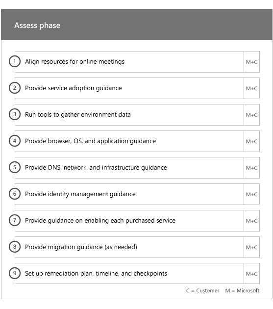

# 온보딩 단계

[적합한 서비스와 요금제](M365-eligible-services-and-plans.md)를 사용하여 Microsoft Azure Active Directory Premium, Microsoft Intune 및 Azure Information Protection을 사용할 준비가 되면 프로세스에 관련된 여러 단계가 있습니다. 다음 섹션에서는 온보딩 프로세스의 각 단계에 대해 설명합니다.

온보딩에는 다음과 같은 4가지 기본 단계가 있습니다.

## 시작 단계

적절한 수의 라이선스를 구매한 후에는 구매 확인 전자 메일의 지침에 따라 라이선스를 기존 테넌트나 새 테넌트에 연결합니다. 그런 다음 Microsoft는 FastTrack Center Benefit에 대한 사용자의 자격 여부를 확인하고 사용자에게 연락하여 온보딩 지원 서비스를 제공하려고 시도합니다.

> [!NOTE]
> 조직에 대해 이러한 서비스를 배포할 준비가 된 경우 [FastTrack 센터](https://go.microsoft.com/fwlink/?linkid=780698)에서 지원을 요청할 수도 있습니다.

### 도움을 요청하려면

1. [FastTrack 사이트](https://go.microsoft.com/fwlink/?linkid=780698)에 로그인합니다.
2. **FastTrack**을 선택합니다.
3. **서비스**를 선택합니다.
4. **Microsoft 365 지원 요청** 양식을 완료합니다.

온보딩 지원이 시작되면 온라인 모임 일정이 설정됩니다.

Microsoft 파트너는 고객 대신 [FastTrack 사이트](https://go.microsoft.com/fwlink/?linkid=780698)를 통해 도움을 얻을 수도 있습니다. 방법은 다음과 같습니다.

1. [FastTrack 사이트](https://go.microsoft.com/fwlink/?linkid=780698)에 로그인합니다.
2. **FastTrack**을 선택합니다.
3. **내 고객**을 선택합니다.
4. 고객을 검색하거나 고객 목록에서 선택합니다.
5. **서비스**를 선택합니다.
6. **Microsoft 365 지원 요청** 양식을 완료합니다.

온보딩 지원이 시작되면 FastTrack은 온라인 모임 일정을 설정하여 온보딩 프로세스에 대해 논의하고 데이터를 확인하며 시작 회의를 설정합니다.

## 평가 단계

온보딩 프로세스가 시작되면 FastTrack 센터는 사용자와 협력하여 원본 환경과 요구 사항을 평가합니다. 도구는 환경을 평가하기 위해 실행되며, FastTrack 전문가는 온-프레미스 Active Directory, 인터넷 브라우저, 클라이언트 장치의 운영 체제, DNS(Domain Name System), 네트워크, 인프라 및 ID 시스템을 평가하도록 안내하여 온보딩에 변경이 필요한지 확인할 수 있도록 합니다.

FastTrack 센터는 적합한 서비스를 성공적으로 채택하도록 지원하는 방법에 대한 지침을 제공합니다.

현재 설정에 따라 EMS 또는 개별 클라우드 서비스에 대한 성공적인 온보딩을 위한 최소 요구 사항까지 원본 환경을 개선하는 재구성 계획을 제공합니다. 또한 재구성 단계에 적합한 검사점 통화도 설정합니다.

## 재구성 단계
필요한 경우 원본 환경에 대한 재구성 계획의 작업을 수행하여 각 서비스의 온보딩 및 채택을 위한 요구 사항을 충족합니다.

사용 단계를 시작하기 전에 먼저 재구성 작업의 결과를 함께 확인하여 계속할 준비가 되었는지 알아봅니다.

## 사용 단계
모든 재구성 작업이 완료되면 프로젝트는 서비스 사용을 위한 핵심 인프라 구성에서 각 적합한 EMS 클라우드 서비스 프로비전으로 전환됩니다.

**사용 단계 - 핵심 기능**

핵심 온보딩에는 서비스 프로비전과 테넌트 및 ID 통합이 포함됩니다. Azure AD Premium, Intune 및 Azure Information Protection과 같은 온보딩 온라인 서비스를위한 기반을 제공하는 단계도 포함됩니다.

> [!NOTE]
> WAP는 웹 응용 프로그램 프록시를 나타냅니다. SSL은 Secure Sockets Layer를 나타냅니다. SDS는 학교 데이터 동기화를 나타냅니다. SDS에 대한 자세한 내용은 [Microsoft 학교 데이터 동기화 시작](https://go.microsoft.com/fwlink/?linkid=871480)을 참조하세요.

> [!NOTE]
> 관리 인증 방법에는 암호 해시 동기화가 포함되지만 이에 국한되지는 않습니다. ID 통합은 일회성 활동이며 관리 또는 페더레이션과 같은 기존 인증 방법의 마이그레이션 또는 서비스 해제는 포함되지 않습니다.

### 사용 단계 - Azure AD Premium

Azure AD Premium 환경은 Azure Active Directory Connect 도구 디렉터리 동기화와 AD FS(Active Directory Federation Service)를 사용하여 설정할 수 있습니다(필요에 따라).

온-프레미스 ID를 클라우드에 동기화하는 것을 포함하는 Azure AD Premium 시나리오의 경우, IT 관리자와 사용자를 구독에 추가하고, 관리 필수 구성 요소를 구성하고, Azure AD Premium을 설정하고, Azure AD Connect 도구를 사용하여 관리 인증 및 AD FS와의 디렉터리 동기화를 설정하고, 테스트 사용자를 구성하고, 서비스에 대한 핵심 사용 사례를 확인합니다.

Azure AD Premium 설정에는 다음 기능이 포함됩니다.

-   Azure Active Directory 셀프 서비스 암호 재설정(SSPR)

-   Aure MFA(Azure 다단계 인증).

-   [Azure Active Directory 마켓플레이스](https://azure.microsoft.com/marketplace/active-directory/)에서 SSO(Single Sign-On)를 사용하여 최대 세 개 이상의 SaaS(Software as a Service) 응용 프로그램 통합

-   
  [앱 통합 자습서 목록](https://docs.microsoft.com/ko-KR/azure/active-directory/saas-apps/tutorial-list)에 열거된 사전 통합된 SaaS 응용 프로그램에 대한 자동 사용자 프로비저닝(아웃바운드 프로비저닝으로만 제한됨)

-   사용자 지정된 로그 화면(로고, 텍스트, 이미지 포함)

-   셀프 서비스 및 동적 그룹(그룹)

-   Azure Active Directory 응용 프로그램 프록시

-   Azure Active Directory Connect 상태

-   Azure Active Directory 조건부 액세스

-   Azure Active Directory 사용 약관

-   Azure Active Directory ID 보호

-   Azure Active Directory Privileged Identity Management

-   Azure Active Directory 액세스 검토

### 사용 단계 - Intune

Intune에서 장치를 관리하는 데 Microsoft Intune을 사용할 수 있도록 준비하는 과정을 안내합니다. 정확한 단계는 원본 환경에 따라 다르며 모바일 장치와 모바일 앱 관리 요구 사항에 기반합니다. 해당 단계는 다음과 같습니다.

-   최종 사용자에게 라이선스 부여 Microsoft 클라우드 서비스 사용자(필요한 경우)의 볼륨 라이선스를 활성화하는 방법에 대한 지원도 제공합니다.

-   온-프레미스 Active Directory 또는 클라우드 ID를 활용하여 Intune에서 사용할 ID 구성

-   Intune 구독에 사용자 추가, IT 관리자 역할 정의, 사용자 및 장치 그룹 만들기

-   다음을 비롯한 관리 요구 사항에 따라 MDM(모바일 장치 관리) 기관 구성

    -   Intune이 유일한 MDM 솔루션이거나 Office 365의 모바일 장치 관리와 함께 사용되는 경우 Intune을 MDM 기관으로 설정합니다.

-   MDM 지침 제공:

    -   MDM 관리 정책의 유효성을 검사하는 데 사용할 테스트 그룹 구성

    -   다음과 같은 MDM 관리 정책 및 서비스 구성

        -   웹 링크 또는 딥 링크를 통해 지원되는 각 플랫폼용 응용 프로그램 배포

        -   조건부 액세스 정책.

        -   조직에서 기존 인증 기관, Wi-Fi 또는 VPN 인프라를 보유하고 있는 경우 전자 메일, 무선 네트워크, VPN(가상 사설망) 프로필 배포

        -   Microsoft Intune Exchange Connector 설정(해당하는 경우)

        -   Intune 데이터 웨어하우스에 연결

        -   다음에 Intune 통합:
            -   원격 지원을 위한 팀 뷰어(팀 뷰어 구독 필수)

            -   MTD(Mobile Threat Defense) 파트너 솔루션(Mobile Threat Defense 파트너 솔루션 구독 필수)

            -   Telecom Expense Management 솔루션(Telecom Expense Management 구독 필수)

            -   Windows Defender Advanced Threat Protection(Windows E5 또는 Microsoft 365 E5 라이선스 필요)

    -   각 [지원되는 플랫폼](https://technet.microsoft.com/library/dn600287.aspx)의 장치를 Intune에 등록합니다.

-   앱 보호 지침 제공:

    -   지원되는 각 플랫폼에 대한 Intune 앱 보호 정책 구성

    -   관리되는 앱에 대한 조건부 액세스 정책 구성

    -   위의 MAM 정책을 사용하여 적절한 사용자 그룹을 대상으로 지정

    -   관리 응용 프로그램 사용 현황 보고서 사용

-   PC 관리 지침 제공

    -   필요한 경우 Intune 클라이언트 소프트웨어 설치

    -   Intune에서 사용할 수 있는 소프트웨어 및 하드웨어 보고서 사용

    > [!IMPORTANT]
    > FastTrack은 Intune을 통한 Windows 10 클래식 PC 관리를 지원하지 않습니다. FastTrack은 Intune MDM(모바일 장치 관리)를 통한 Windows 10 장치 관리만 지원합니다.

#### Windows Autopilot

FastTrack은 장치에 사용자 지정 운영 체제 이미지를 작성, 유지 관리 및 적용할 필요 없이 최종 사용자에게 새로운 장치를 제공하여 Windows Autopilot 및 Intune으로 장치 프로비저닝을 단순화하는 데 도움을 줄 수 있습니다.

FastTrack은 다음과 같은 Autopilot 시나리오를 지원합니다.

- **Azure AD 셀프 서비스:** 장치는 Azure AD에 가입하고 Intune에 등록합니다. 이 시나리오는 Windows 10 1703 및 최신 버전을 사용하는 경우 지원됩니다.

- **Hybrid AAD 셀프 서비스:** 장치가 온-프레미스 AD와 Azure AD에 모두 가입하고 Intune에 등록합니다. 이 시나리오는 Windows 10 1809 및 최신 버전을 사용하는 경우 지원됩니다.

- **셀프 프로비전:** 장치가 Azure AD에 자동으로 가입됩니다. 이 시나리오는 Windows 1809 및 최신 버전을 사용하는 경우 지원됩니다.

    > [!IMPORTANT]
    > FastTrack은 Configuration Manager에서 시작한 Autopilot 시나리오를 지원하지 않습니다.

Windows Autopilot를 설정하는 단계에는 원본 환경에 따라 다음이 포함될 수 있습니다.

- Windows Autopilot용 Microsoft Intune을 구성하고 설정합니다.

- Azure AD 동적 그룹 구성

- Azure AD에 회사 브랜드를 추가합니다.

- 장치를 만든 후 Windows Autopilot 프로필(예: 로컬 관리자 계정 만들기를 제한하는 Windows Autopilot 프로필)에 할당합니다.

- 조직의 요구 사항을 준수하도록 OOBE(Out-of-Box-Experience)를 사용자 지정합니다.

- Azure AD 및 Intune에서 MDM 자동 등록 구성

#### iOS 및 Android용 Outlook을 안전하게 배포

FastTrack은 iOS 및 Android용 Outlook을 조직에 안전하게 배포하여 사용자가 필요한 모든 앱을 설치하도록 보장합니다.

Intune을 사용하여 iOS 및 Android용 Outlook Mobile을 안전하게 배포하는 단계에는 원본 환경에 따라 다음이 포함될 수 있습니다.

- iOS 및 Android용 Outlook, Microsoft Authenticator 및 Intune Company 포털 앱을 Apple App Store 또는 Google Play 스토어에서 다운로드합니다.
- 또한 설정에 대한 지침을 제공합니다.
    - Intune을 사용한 iOS 및 Android용 Outlook, Microsoft Authenticator 및 Intune Company 포털 앱 배포
    - 앱 보호 정책
    - 조건부 액세스 정책
    - 앱 구성 정책

    > [!IMPORTANT]
    > FastTrack 팀은 Exchange 모바일 장치 사서함 정책을 사용하여 iOS 및 Android용 Outlook 보안을 지원하지 않습니다.

#### 공동 관리

FastTrack은 Configuration Manager와 Intune을 사용하여 Windows 10 장치를 동시에 관리할 수 있도록 도와줍니다. 정확한 단계는 원본 환경에 따라 달라지며, 다음이 포함될 수 있습니다.

- 공동 관리의 이점에 대한 설명

- 최종 사용자에게 라이선스 부여 FastTrack은 Microsoft 클라우드 서비스 테넌트(필요한 경우)의 볼륨 라이선스를 활성화하는 방법에 대한 지원도 제공합니다.

- 온-프레미스 Active Directory 및/또는 클라우드 ID를 활용하여 Intune에서 사용할 ID 구성

- Intune 구독에 사용자 추가, IT 관리자 역할 정의, 사용자 및 장치 그룹 만들기

- 하이브리드(System Center Configuration Manager)와 통합된 Intune에서 Intune 독립 실행형으로 이동하는 방법에 대한 지침 제공

- MDM 자동 등록을 위해 Azure Active Directory 설정하는 방법에 대한 지침 제공

- 하이브리드 Azure Active Directory 참가를 설정하는 방법에 대한 지침 제공

- 클라우드 관리 게이트웨이를 설정하는 방법에 대한 지침을 제공

- Configuration Manager 콘솔에서 공동 관리를 사용하도록 설정

- Intune으로 전환할 지원되는 작업 부하를 구성

- Intune에 등록된 장치에 Configuration Manager 클라이언트를 설치합니다.

- 환경에서 공동 관리 활동을 모니터링하는 방법에 대한 지침을 제공

FastTrack은 또한 적합한 서비스를 성공적으로 채택하도록 지원하는 방법에 대한 지침을 제공합니다.

#### 사용 단계 - Azure Information Protection

고객에게는 다음을 하는 방법에 대한 지침이 제공됩니다. 

- 테넌트를 활성화하고 구성하기
- 레이블과 정책을 만들고 설정하기
- 문서에 정보 보호 적용하기 
- Azure Information Protection 클라이언트를 사용하여 Windows에서 실행 중인 Office 앱(Word, PowerPoint, Excel, Outlook 등)에서 자동으로 정보 분류 및 레이블 지정하기
- Azure Information Protection 스캐너를 사용하여 보관 중인 파일 사용하기
- Exchange Online 메일 흐름 규칙을 사용하여 전송 중인 전자 메일 모니터링하기

Microsoft Azure RMS(권한 관리 서비스), OME(Office 365 메시지 암호화) 및 DLP(데이터 손실 방지)를 사용하여 보호를 적용하려는 고객에게도 지침이 제공됩니다.

> [!NOTE]
> **추가 정보가 필요하십니까?** [Enterprise Mobility + Security](https://www.microsoft.com/en-us/cloud-platform/enterprise-mobility)를 참조하세요.

## 다음 단계

[EMS용 FastTrack 혜택 - Microsoft 책임](EMS-fasttrack-responsibilities.md)
