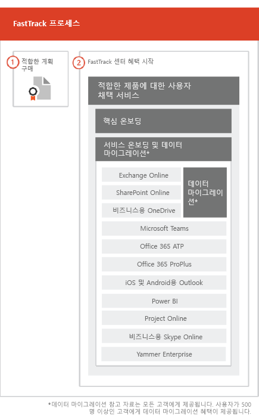

# FastTrack 프로세스The FastTrack Process

FastTrack 프로세스는 온보딩 및 사용자 채택 서비스를 제공합니다. The FastTrack process provides onboarding and user adoption services. 
  
온보딩은 다음으로 구성되어 있습니다.Onboarding consists of:
  
- *핵심 온보딩* — 테넌트 구성 및 필요한 경우 Azure Active Directory(Azure AD)와의 통합에 필요한 작업을 나타냅니다. 핵심 온보딩은 기타 적합한 서비스를 온보딩하기 위한 기준도 제공합니다.*Core onboarding* — These are tasks required for tenant configuration and integration with Azure Active Directory (Azure AD) if needed. Core onboarding also provides the baseline for onboarding other eligible services. 
- *서비스 온보딩 및 마이그레이션* - 서비스 온보딩 작업을 통해 테넌트에서 시나리오를 활성화할 수 있습니다. 데이터 마이그레이션(전자 메일, 파일 등)은 [데이터 마이그레이션](O365-data-migration.md)에 포합됩니다.*Service onboarding and migration* — Service onboarding tasks enable scenarios in your tenant. Data migration (including email and files) is covered in [Data Migration](O365-data-migration.md). 
    
사용자 채택 서비스는 사용자가 적합한 서비스를 인식하고 비즈니스 가치를 창출하는 데 사용할 수 있는 지침을 제공하는 작업으로 구성됩니다. 이 지원은 온보딩 활동과 동시에 이루어집니다.User adoption services are comprised of tasks that provide guidance for you to ensure your users are aware of the eligible services and can use them to drive business value. This assistance occurs in parallel to onboarding activities.
  
> [!NOTE]
> FastTrack에서는 빠르고 예측 가능한 결과를 제공하도록 설계된 권장 접근 방법, 지침 및 모범 사례를 제공합니다. 이 지침 이외의 내용을 배포하도록 선택한 경우 온보딩 환경 및 서비스 사용에 영향을 미칩니다. 지침은 구두 및 서면 지원의 조합으로 정의됩니다. FastTrack Specialists에서 지침을 제공하는 경우 FaskTrack 담당자는 사용자 대신 작업할 수 없습니다. 현재 구독하는 경우 FastTrack 서비스를 사용하여 모든 정품 작업을 등록하고 채택할 수 있습니다.FastTrack provides customers with a recommended approach, guidance, and best practices engineered to deliver quick and predictable outcomes. If you choose to deploy outside of this guidance, your onboarding experience and usage of the service may be impacted. Guidance is defined as a combination of verbal and written assistance. When FastTrack Specialists provide guidance, FastTrack personnel cannot act on your behalf. You can use FastTrack services to onboard and adopt any qualifying product workload as long as your subscription is current. 
  
## 온보딩 프로세스The onboarding process

다음 그림은 온보딩 프로세스를 나타냅니다.The following diagram illustrates the onboarding process.
  

  
[Microsoft 365 관리 센터](https://go.microsoft.com/fwlink/?linkid=2032704) 또는 [FastTrack 사이트](https://go.microsoft.com/fwlink/?linkid=780698)를 통해 도움을 얻을 수 있습니다.You can get help through the [Microsoft 365 admin center](https://go.microsoft.com/fwlink/?linkid=2032704) or the [FastTrack site](https://go.microsoft.com/fwlink/?linkid=780698). 

[Microsoft 365 관리 센터](https://go.microsoft.com/fwlink/?linkid=2032704)에서 도움을 얻으려면 관리자 권한으로 관리 센터에 로그인하고 **도움이 필요하십니까?** 위젯을 클릭합니다.To get help through the [Microsoft 365 admin center](https://go.microsoft.com/fwlink/?linkid=2032704), your admin signs into the admin center and then clicks the **Need help?** widget. 

[FastTrack 사이트](https://go.microsoft.com/fwlink/?linkid=780698)에서 도움을 얻으려면To get help through the [FastTrack site](https://go.microsoft.com/fwlink/?linkid=780698): 
1.  [FastTrack 사이트](https://go.microsoft.com/fwlink/?linkid=780698)에 로그인합니다.Sign in to the [FastTrack site](https://go.microsoft.com/fwlink/?linkid=780698). 
2.  **서비스**를 선택합니다.Select **Services**.
3.  **Microsoft 365 지원 요청** 양식을 완료합니다.Complete the **Request for Assistance with Microsoft 365** form. 
  
 또는 테넌트에 대한 사용 가능한 서비스 목록에서 [FastTrack 사이트](https://go.microsoft.com/fwlink/?linkid=780698)에서 FastTrack 센터 지원을 요청할 수 있습니다.You can also ask for FastTrack Center help from the [FastTrack site](https://go.microsoft.com/fwlink/?linkid=780698) in the list of available services for your tenant. 
    
 온보딩 지원이 시작되면 온라인 모임 일정이 설정됩니다.Once onboarding assistance starts, we set up a schedule of online meetings.
    
파트너는 고객 대신 [FastTrack 사이트](https://go.microsoft.com/fwlink/?linkid=780698)를 통해 도움을 얻을 수도 있습니다. 이렇게 하려면 다음을 수행합니다.Partners can also get help through the [FastTrack site](https://go.microsoft.com/fwlink/?linkid=780698) on behalf of a customer. To do so:
1.  [FastTrack 사이트](https://go.microsoft.com/fwlink/?linkid=780698)에 로그인합니다.Sign in to the [FastTrack site](https://go.microsoft.com/fwlink/?linkid=780698). 
2.  **내 고객**을 선택합니다.Select **My Customers**.
3.  고객을 검색하거나 고객 목록에서 선택합니다.Search for your customer or select them from your customer list.
4.  **서비스**를 선택합니다.Select **Services**.
5.  **Microsoft 365 지원 요청** 양식을 완료합니다.Complete the **Request for Assistance with Microsoft 365** form. 

다음 표에는 프로세스에 대한 역할 및 책임이 나와 있습니다.The following table lists roles and responsibilities for the process.
    
|||
|:-----|:-----|
|**역할****Role**   |**책임****Responsibility**   |
|**FastTrack Specialist****FastTrack Specialist**   |온보딩, 마이그레이션, 사용자 채택 서비스를 모두 원격으로 제공합니다.Provides all onboarding, migration, and user adoption services remotely.    도구, 게시된 설명서를 조합해서 원격으로 사용자를 지원합니다.Assists you remotely by using a combination of tools and published documentation.   사용자와 직접 또는 대리인과 작업할 수 있습니다.Works directly with you or your representative.   전자 메일 및 데이터 마이그레이션 지침을 제공합니다.Provides email and data migration guidance.|
|**FastTrack 센터****FastTrack Center**    |핵심 및 서비스 온보딩과 적합한 서비스의 성공적인 채택 계획에 대한 지침을 제공합니다.Provides guidance with core and service onboarding and planning successful adoption of eligible services.    지원을 제공하며 지정된 지역의 일반 업무 시간 동안 사용할 수 있습니다.Provides assistance and is available during normal business hours for a given region.   중국어 번체, 중국어 간체(지원 담당자가 만다린어만 사용), 영어, 프랑스어, 독일어, 이탈리아어, 일본어, 한국어, 포르투갈어(브라질), 스페인어, 태국어 및 베트남어로 지원이 제공됩니다.Provides assistance in Traditional Chinese and Simplified Chinese (resources speak Mandarin only), English, French, German, Italian, Japanese, Korean, Portuguese (Brazil), Spanish, Thai, and Vietnamese.|

  

