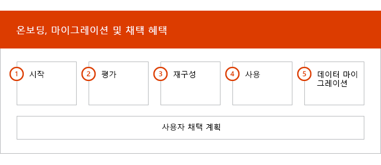
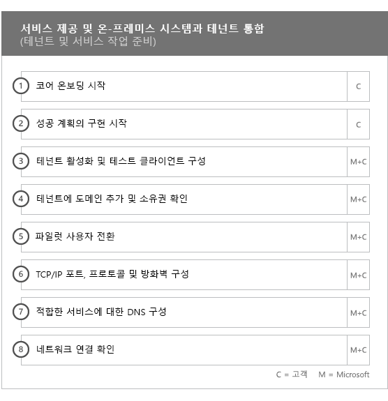
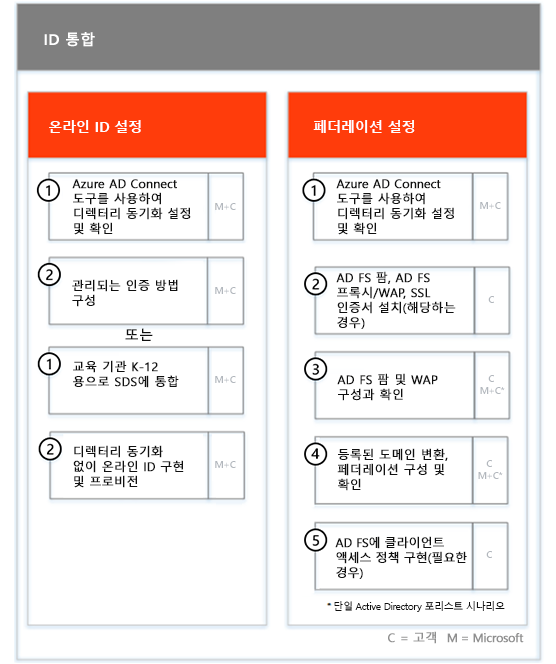
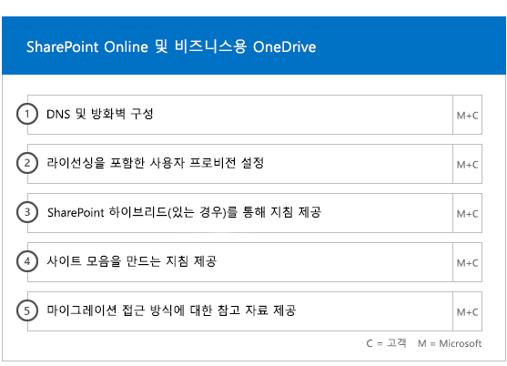
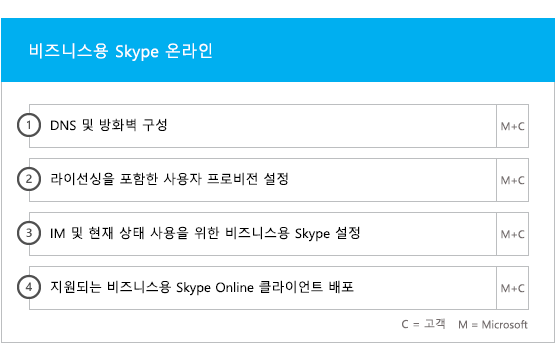
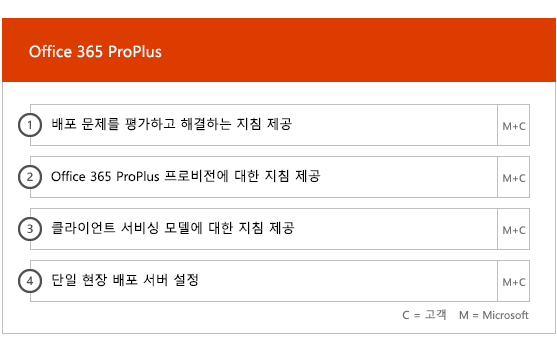

# 온보딩 및 마이그레이션 단계

Office 365 온보딩은 시작, 평가, 재구성 및 사용의 네 가지 기본 단계로 구성됩니다. 다음 그림과 같이 이러한 단계 다음에는 선택적 데이터 마이그레이션 단계가 올 수 있습니다.
  

  
> [!NOTE]
>Office 365 US Government의 온보딩 및 마이그레이션에 대한 내용은 [Office 365 US Government의 온보딩 및 마이그레이션](US-Gov-appendix-onboarding-and-migration.md)을 참조하세요. 

각 단계의 세부 작업은 [FastTrack 책임](O365-fasttrack-responsibilities.md) 및 [사용자의 업무](O365-your-responsibilities.md)을 참조하세요.
  
## 시작 단계

적합한 유형의 라이선스를 적절한 수만큼 구매한 후에는 구매 확인 전자 메일의 지침에 따라 라이선스를 기존 테넌트나 새 테넌트에 연결합니다. 
  
[Microsoft 365 관리 센터](https://go.microsoft.com/fwlink/?linkid=2032704) 또는 [FastTrack 사이트](https://go.microsoft.com/fwlink/?linkid=780698)를 통해 도움을 얻을 수 있습니다. 

[Microsoft 365 관리 센터](https://go.microsoft.com/fwlink/?linkid=2032704)에서 도움을 얻으려면 관리자 권한으로 관리 센터에 로그인하고 **도움이 필요하십니까?** 위젯을 클릭합니다. 

[FastTrack 사이트](https://go.microsoft.com/fwlink/?linkid=780698)에서 도움을 얻으려면 
1.  [FastTrack 사이트](https://go.microsoft.com/fwlink/?linkid=780698)에 로그인합니다. 
2.  **서비스**를 선택합니다.
3.  **Microsoft 365 지원 요청** 양식을 완료합니다. 
> [!NOTE]
>  파트너가 Office 365 테넌트에 포함되는 경우 이 옵션이 표시되지 않습니다. 파트너에게 지원을 요청하세요. 
  
파트너는 고객 대신 [FastTrack 사이트](https://go.microsoft.com/fwlink/?linkid=780698)를 통해 도움을 얻을 수도 있습니다. 이렇게 하려면 다음을 수행합니다.
1.  [FastTrack 사이트](https://go.microsoft.com/fwlink/?linkid=780698)에 로그인합니다. 
2.  **내 고객**을 선택합니다.
3.  고객을 검색하거나 고객 목록에서 선택합니다.
4.  **서비스**를 선택합니다.
5.  **Microsoft 365 지원 요청** 양식을 완료합니다.

또는 테넌트에 대한 사용 가능한 서비스 목록에서 [FastTrack 사이트](https://go.microsoft.com/fwlink/?linkid=780698)에서 FastTrack 센터 지원을 요청할 수 있습니다. 
    
이 단계에서는 온보딩 프로세스를 논의하고, 데이터를 확인하며, 킥오프 모임을 설정합니다. 여기에는 서비스를 사용하는 목적과 서비스 사용을 추진하기 위해 조직의 목표와 계획을 이해하기 위한 협업이 포함됩니다.
  

  
## 평가 단계

FastTrack 관리자는 채택 팀과 함께 상호 성공적인 계획 통화를 수행합니다. 이 작업을 통해 구매한 적합한 서비스의 기능, 성공에 필요한 주요 기초 사안, 서비스 사용을 추진하는 방법 및 서비스로부터 가치를 얻기 위해 사용할 수 있는 시나리오를 알 수 있습니다. Microsoft는 성공적인 계획을 지원하며 필요에 따라 주요 영역에 대한 피드백을 제공합니다.
  
FastTrack Specialists는 사용자와 함께 원본 환경과 요구 사항을 평가합니다. 환경에 대한 데이터를 수집할 수 있는 도구를 제공하며, Microsoft에서 사용자가 대역폭 요구 사항을 예측하고 인터넷 브라우저, 클라이언트 운영 체제, DNS(Domain Name System), 네트워크, 인프라 및 ID 시스템을 평가하도록 안내하여 온보딩에 변경이 필요한지 확인할 수 있도록 합니다. 
  
현재 설정에 따라 Office 365로의 정상적인 온보딩과, 필요한 경우 사서함 및/또는 데이터 마이그레이션 완료에 필요한 최소 요구 사항까지 원본 환경을 개선하는 재구성 계획을 제공합니다. 최종 사용자의 가치와 채택을 높이기 위해 여러 가지 작업을 제안해드립니다. 또한 재구성 단계에 적합한 검사점 통화도 설정합니다.
  

  
## 재구성 단계

원본 환경을 기준으로 재구성 작업을 수행하여 필요에 따라 각 서비스의 온보딩, 채택 및 마이그레이션을 위한 요구 사항을 충족합니다.
  

  
또한 최종 사용자의 가치와 채택을 높이기 위해 여러 가지 작업을 제안해드립니다. 사용 단계를 시작하기 전에 먼저 재구성 작업의 결과를 함께 확인하여 계속할 준비가 되었는지 알아봅니다. 
  
이 단계에서 FastTrack 관리자는 성공적인 계획을 위해 협업하고 올바른 리소스와 모범 사례를 안내하여 조직에서 사용할 수 있는 서비스를 제공하고 서비스 전반에서 사용을 유도할 수 있도록 지침을 제공합니다.
  
## 사용 단계

모든 재구성 작업이 완료되면 초점이 서비스 사용을 위한 핵심 인프라 구성, Office 365 프로비전 및 작업 이행에서 서비스 채택 지원으로 전환됩니다. 
  
## 핵심

핵심 온보딩에는 서비스 프로비전과 테넌트 및 ID 통합이 포함됩니다. 또한 Exchange Online, SharePoint Online, 비즈니스용 Skype 온라인 등 온보딩 서비스에 기초 사안을 제공하기 위한 단계도 포함됩니다. FastTrack 관리자와 함께 목표에 대한 진척 사항을 평가하고 필요한 추가 지원이 무엇인지 결정하도록 성공적인 계획 확인 회의를 계속 진행합니다.
  

  

  
> [!NOTE]
> WAP는 웹 응용 프로그램 프록시를 나타냅니다. SSL은 Secure Sockets Layer를 나타냅니다. SDS는 학교 데이터 동기화를 나타냅니다. SDS에 대한 자세한 내용은 [Microsoft 학교 데이터 동기화 시작](https://go.microsoft.com/fwlink/?linkid=871480)을 참조하세요. 
  
하나 이상의 적합한 서비스에 대한 온보딩은 핵심 온보딩이 완료되면 시작됩니다.
  
## Exchange Online

Exchange Online의 경우 조직에서 전자 메일 사용 준비를 진행하도록 안내해드립니다. 정확한 단계는 원본 환경과 전자 메일 마이그레이션 계획에 달라집니다. 사용자를 지원하기 위해 다음 내용이 포함될 수 있습니다.
- Office 365에서 유효성이 검사된 모든 메일 사용이 가능한 도메인에 대해 EOP(Exchange Online Protection) 기능을 설정합니다.
    > [!NOTE]
    > 메일 교환(MX) 레코드는 Office 365를 가리켜야 합니다. 
- Exchange Online ATP (Advanced Threat Protection) 기능이 구독 서비스의 일부인 경우 이를 설정합니다. MX 레코드가 Office 365를 가리키면 완료됩니다. 이 기능은 Exchange Online Protection 맬웨어 방지 설정의 일부로 구성됩니다.
- 구독 서비스의 일부로 Office 365에서 확인된 모든 메일 사용 가능 도메인에 대한 데이터 손실 방지(DLP) 기능 설정. MX 레코드가 Office 365를 가리키면 완료됩니다.
- 구독 서비스의 일부로 Office 365에서 확인된 모든 메일 사용 가능 도메인에 대해 Office 365 메시지 암호화(OME)를 설정합니다. MX 레코드가 Office 365를 가리키면 완료됩니다.
- 방화벽 포트 구성
- DNS 설정(필요한 자동 검색, SPF(보낸 사람 정책 프레임워크) 및 MX 레코드 포함)(필요에 따라 다름) 
- 원본 메시징 환경과 Exchange Online 간 전자 메일 흐름 설정(필요한 경우)
- 원본 메시징 환경에서 Office 365로 메일 마이그레이션 수행
- 사서함 클라이언트(Windows용 Outlook, 웹용 Outlook, iOS 및 Android용 Outlook) 구성
    > [!NOTE]
    > 메일 및 데이터 마이그레이션에 대한 자세한 내용은 [데이터 마이그레이션](O365-data-migration.md)을 참조하세요. 
  

  
## SharePoint Online 및 비즈니스용 OneDrive

SharePoint Online 및 비즈니스용 OneDrive에 대해 다음에 대한 지침이 제공됩니다.
- DNS 설정.
- 방화벽 포트 구성
- 사용자 및 라이선스 프로비전   
- 하이브리드 검색, 하이브리드 사이트, 하이브리드 분류, 콘텐츠 형식, 하이브리드 셀프 서비스 사이트 만들기(SharePoint Server 2013 전용), 확장된 앱 시작 관리자, 하이브리드 비즈니스용 OneDrive, 익스트라넷 사이트 등의 SharePoint 하이브리드 기능을 구성합니다.
    
FastTrack Specialists는 Office 365로의 데이터 마이그레이션에 대한 참고 자료를 제공합니다. 도구 및 설명서를 함께 사용하고 적용 및 실행 가능한 구성 작업을 수행하여 도움을 드립니다.
  

  
## 비즈니스용 OneDrive

비즈니스용 OneDrive의 경우 단계는 사용자가 현재 SharePoint를 사용하고 있는지 여부, 또는 사용하고 있다면 어떤 버전을 사용하고 있는지에 따라 다릅니다. 
  

  
## Microsoft Teams

Microsoft Teams에 대해 다음에 대한 지침이 제공됩니다.
- 최소 요구 사항 확인.  
- 방화벽 포트 구성   
- DNS 설정. 
- Office 365 테넌트에서 Microsoft 팀 확인이 가능합니다  
- 사용자 라이선스 사용 또는 사용 안 함.
    

## 비즈니스용 Skype Online

비즈니스용 Skype Online에 대해 다음에 대한 지침이 제공됩니다.
- 방화벽 포트 구성
- DNS 설정.   
- 채팅방 시스템 장치용 계정 만들기   
- 지원되는 비즈니스용 Skype 온라인 클라이언트 배포  
- 온-프레미스 Lync 2010, Lync 2013 또는 비즈니스용 Skype 2015 서버 환경 및 비즈니스용 Skype 온라인 테넌트(해당하는 경우), 통화 계획, Skype 모임 브로드캐스트, 전화 시스템 및 통화 계획(사용 가능한 시장) 간에 분할 도메인 서버 구성을 설정합니다.
    

  

  
## Power BI

Power BI에 대해 다음에 대한 지침이 제공됩니다. 
- Power BI 라이선스를 할당합니다.
- Power BI Desktop 앱을 배포합니다.
    
## Project Online

Project_Online에 대해 다음에 대한 지침이 제공됩니다.
  
- Project Online이 사용하는 기본 SharePoint 기능 확인   
- 테넌트에 Project Online 서비스 추가(사용자에게 구독 추가 포함)  
- ERP(Enterprise 자원 그룹) 설정 
- 첫 번째 프로젝트 만들기 
    

  
## Project Online Professional 및 Premium

Project Online Professional 및 Project Online Premium에 대해 다음에 대한 지침이 제공됩니다.
- 배포 문제 해결
- [Microsoft 365 관리 센터](https://go.microsoft.com/fwlink/?linkid=2032704) 및 Windows PowerShell을 사용하여 최종 사용자 라이선스 할당  
- 간편 실행을 사용하여 Office 365 포털에서 Project Online 데스크톱 클라이언트 설치
- Office 365 배포 도구를 사용하여 업데이트 설정 구성  
- Project Online 데스크톱 클라이언트를 위한 단일 사이트에 배포 서버 설정(Office 365 배포 도구용 configuration.xml 파일을 만드는 지침 포함)  
- Project Online 데스크톱 클라이언트을 Project Online Professional 또는 Project Online Premium에 연결합니다.
    

  
## Yammer Enterprise

Yammer에 대해 Yammer Enterprise 서비스를 사용하기 위한 지침이 제공됩니다.
  
## Office 365 ProPlus

Office 365 ProPlus에 대해 다음에 대한 지침이 제공됩니다.
- 배포 문제 해결   
- [Microsoft 365 관리 센터](https://go.microsoft.com/fwlink/?linkid=2032704) 및 Windows PowerShell을 사용하여 최종 사용자 라이선스 할당 
- 간편 실행을 사용하여 Office 365 포털에서 Office 365 ProPlus 설치   
- iOS, Android 또는 Windows Mobile 장치에 Office Mobile 앱(에: Outlook Mobile, Word Mobile, Excel Mobile 및 PowerPoint Mobile) 설치   
- Office 365 배포 도구를 사용하여 업데이트 설정 구성   
- Office 365 ProPlus를 위한 단일 사이트에 배포 서버 설정(Office 365 배포 도구용 configuration.xml 파일을 만드는 지침 포함)  
- Microsoft System Center Configuration Manager를 사용하여 배포(System Center Configuration Manager 패키지 생성에 대한 지원 포함)
    

  
## Microsoft StaffHub

Microsoft StaffHub에 대해 다음에 대한 지침이 제공됩니다.
- Office 365 테넌트에서 Microsoft StaffHub를 사용할 수 있는지 확인합니다.
- 사용자 라이선스 사용 또는 사용 안 함.
- 주요 제품 기능. 
- Microsoft StaffHub의 다운로드 위치.
    

  
## iOS 및 Android용 Outlook

iOS 및 Android용 Outlook의 경우 다음 지침을 제공합니다.
- Apple App Store를 Google Play에서 iOS 및 Android용 Outlook 다운로드
- 계정 구성 및 Exchange Online 사서함 액세스

