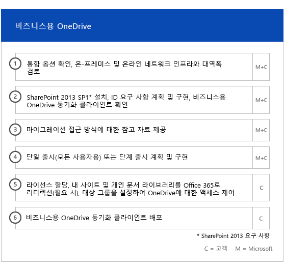

# 온 보 딩 및 마이그레이션 단계에 대 한 Office 365 미국 정부 기관Onboarding and Migration Phases for Office 365 US Government

Office 365 온보딩은 시작, 평가, 재구성 및 사용의 네 가지 기본 단계로 구성됩니다. 다음 그림과 같이 이러한 단계 다음에는 선택적 데이터 마이그레이션 단계가 올 수 있습니다.Office 365 onboarding has four primary phases—Initiate, Assess, Remediate, and Enable. You can follow these phases with an optional data migration phase as shown in the following figure.
  

  
각 단계에 대 한 자세한 작업에 대 한 [Office 365 미국 정부 기관에 대 한 FastTrack 책임](US-Gov-appendix-fasttrack-responsibilities.md) 및 [Office 365 미국 정부 기관에 대 한 사용자의 책임](US-Gov-appendix-your-responsibilities.md)을 참조 하십시오.For detailed tasks for each phase, see [FastTrack Responsibilities for Office 365 US Government](US-Gov-appendix-fasttrack-responsibilities.md) and [Your Responsibilities for Office 365 US Government](US-Gov-appendix-your-responsibilities.md).
  
## 시작 단계Initiate phase

적합한 유형의 라이선스를 적절한 수만큼 구매한 후에는 구매 확인 전자 메일의 지침에 따라 라이선스를 기존 테넌트나 새 테넌트에 연결합니다.After you purchase the appropriate number and types of licenses, follow the guidance from the purchase confirmation email to associate the licenses to your existing or new tenant. 
  
- Office 365 관리 센터 또는 [FastTrack 사이트](https://go.microsoft.com/fwlink/?linkid=780698)를 통해 도움을 얻을 수 있습니다. Office 365 관리 센터에서 도움을 얻으려면 관리자 권한으로 관리 센터에 로그인하고 **도움이 필요하십니까?** 위젯을 클릭합니다. [FastTrack 사이트](https://go.microsoft.com/fwlink/?linkid=780698)에서 도움을 얻으려면 로그인하고 **서비스** 를 클릭한 후 **Office 365에 대한 도움 요청** 양식을 완료합니다.You can get help through the Office 365 admin center or the [FastTrack site](https://go.microsoft.com/fwlink/?linkid=780698). To get help through the Office 365 admin center, your admin signs into the admin center and then clicks the **Need help?** widget. To get help through the [FastTrack site](https://go.microsoft.com/fwlink/?linkid=780698), sign in, click **Services**, and complete the **Request Assistance for Office 365** form. 
    
    > [!NOTE]
    >  파트너가 Office 365 테넌트에 포함되는 경우 이 옵션이 표시되지 않습니다. 파트너에게 지원을 요청하세요.If you have a partner listed in your Office 365 tenant, you won't see this option. Please consult your partner for assistance. 
  
- 파트너는 고객 대신 [FastTrack 사이트](https://go.microsoft.com/fwlink/?linkid=780698)를 통해 도움을 얻을 수도 있습니다. 이렇게 하려면 파트너는 사이트에 로그인하고 고객 레코드를 선택한 후 **서비스** 를 클릭하고 **Office 365에 대한 도움 요청** 양식을 완료합니다.Partners can also get help through the [FastTrack site](https://go.microsoft.com/fwlink/?linkid=780698) on behalf of a customer. To do so, the partner signs in to the site, selects the customer record, clicks **Services**, and completes the **Request Assistance for Office 365** form. 
    
- 또는 테넌트에 대한 사용 가능한 서비스 목록에 포함된 [FastTrack 사이트](https://go.microsoft.com/fwlink/?linkid=780698)에서 FastTrack 센터 지원을 요청할 수 있습니다.You can also ask for FastTrack Center help from the [FastTrack site](https://go.microsoft.com/fwlink/?linkid=780698) in the list of available services for your tenant. 
    
이 단계에서는 온보딩 프로세스를 논의하고, 데이터를 확인하며, 킥오프 모임을 설정합니다.During this phase, we discuss the onboarding process, verify your data, and set up a kickoff meeting.
  
여기에는 서비스를 사용하는 목적과 서비스 사용을 추진하기 위해 조직의 목표와 계획을 이해하기 위한 협업이 포함됩니다.This includes working with you to understand how you intend to use the service and your organization's goals and plans to drive service usage.
  

  
## 평가 단계Assess phase

FastTrack 관리자는 채택 팀과 함께 상호 성공적인 계획 통화를 수행합니다. 이 작업을 통해 구매한 적합한 서비스의 기능, 성공에 필요한 주요 기초 사안, 서비스 사용을 추진하는 방법 및 서비스로부터 가치를 얻기 위해 사용할 수 있는 시나리오를 알 수 있습니다. Microsoft는 성공적인 계획을 지원하며 필요에 따라 주요 영역에 대한 피드백을 제공합니다.Your FastTrack Manager conducts an interactive success planning call with you and your adoption team. This introduces you to the capabilities of the eligible services you purchased, the key foundations you need for success, the methodology for driving usage of the service, and scenarios you can use to get value from the services. We assist you in success planning and provide feedback on key areas (as needed).
  
FastTrack 전문가 원본 환경 및 요구 사항 평가 하기 위해 함께 작업을 수행 합니다. 사용자 환경에 대 한 데이터를 수집 하 고 대역폭 요구 사항 예측 하 고 평가 하 여 인터넷 브라우저, 클라이언트 운영 체제, 시스템 DNS (Domain Name), 네트워크, 인프라 및 id 시스템을 단계별로 안내 하는 도구 제공 변경 내용을 온 보 딩에 필요한 있지 않은지 확인 합니다.FastTrack Specialists work with you to assess your source environment and the requirements. We provide tools for you to gather data about your environment and guide you through estimating bandwidth requirements and assessing your internet browsers, client operating systems, Domain Name System (DNS), network, infrastructure, and identity system to determine if any changes are required for onboarding. 
  
현재 설정에 따라 Office 365로의 정상적인 온보딩과, 필요한 경우 사서함 및/또는 데이터 마이그레이션 완료에 필요한 최소 요구 사항까지 원본 환경을 개선하는 재구성 계획을 제공합니다. 최종 사용자의 가치와 채택을 높이기 위해 여러 가지 작업을 제안해드립니다. 또한 재구성 단계에 적합한 검사점 통화도 설정합니다.Based on your current setup, we provide a remediation plan that brings your source environment up to the minimum requirements for successful onboarding to Office 365 and, if needed, for successful mailbox and/or data migration. We provide a set of suggested activities to increase end user value and adoption. We also set up appropriate checkpoint calls for the Remediate phase.
  

  
## 재구성 단계Remediate phase

원본 환경을 기준으로 재구성 작업을 수행하여 필요에 따라 각 서비스의 온보딩, 채택 및 마이그레이션을 위한 요구 사항을 충족합니다.You do the remediation tasks based on your source environment so that you meet the requirements for onboarding, adopting, and migrating each service as needed.
  

  
또한 최종 사용자의 가치와 채택을 높이기 위해 여러 가지 작업을 제안해드립니다. 사용 단계를 시작하기 전에 먼저 재구성 작업의 결과를 함께 확인하여 계속할 준비가 되었는지 알아봅니다.We also provide a set of suggested activities to increase end user value and adoption. Before beginning the Enable phase, we jointly verify the outcomes of the remediation activities to make sure you're ready to proceed. 
  
이 단계에서 FastTrack 관리자는 성공적인 계획을 위해 협업하고 올바른 리소스와 모범 사례를 안내하여 조직에서 사용할 수 있는 서비스를 제공하고 서비스 전반에서 사용을 유도할 수 있도록 지침을 제공합니다.During this phase, your FastTrack Manager works with you on success planning, guiding you to the right resources and best practices to provide guidance for you to make the service available to your organization and drive usage across the services.
  
## 사용 단계Enable phase

모든 재구성 작업이 완료되면 초점이 서비스 사용을 위한 핵심 인프라 구성, Office 365 프로비전 및 작업 이행에서 서비스 채택 지원으로 전환됩니다.When all remediation activities are complete, the focus shifts to configuring the core infrastructure for service consumption, provisioning Office 365, and conducting the activities to drive service adoption. 
  
## 핵심Core

핵심 온보딩에는 서비스 프로비전과 테넌트 및 ID 통합이 포함됩니다. 또한 Exchange Online, SharePoint Online, 비즈니스용 Skype 온라인 등 온보딩 서비스에 기초 사안을 제공하기 위한 단계도 포함됩니다. FastTrack 관리자와 함께 목표에 대한 진척 사항을 평가하고 필요한 추가 지원이 무엇인지 결정하도록 성공적인 계획 확인 회의를 계속 진행합니다.Core onboarding involves service provisioning and tenant and identity integration. It also includes steps for providing a foundation for onboarding services like Exchange Online, SharePoint Online, and Skype for Business Online. You and your FastTrack Manager continue to have success planning checkpoint meetings to evaluate progress against your goals and determine what further assistance you need.
  

  

  
> [!NOTE]
> WAP는 웹 응용 프로그램 프록시를 나타냅니다. SSL은 Secure Sockets Layer를 나타냅니다. SDS는 학교 데이터 동기화를 나타냅니다. SDS에 대한 자세한 내용은 [Microsoft 학교 데이터 동기화 시작](https://go.microsoft.com/fwlink/?linkid=871480)을 참조하세요.WAP stands for Web Application Proxy. SSL stands for Secure Sockets Layer. SDS stands for School Data Sync. For more information on SDS, see [Welcome to Microsoft School Data Sync](https://go.microsoft.com/fwlink/?linkid=871480). 
  
하나 이상의 적합한 서비스에 대한 온보딩은 핵심 온보딩이 완료되면 시작됩니다.Onboarding for one or more eligible services can begin once core onboarding is finished.
  
## Exchange OnlineExchange Online

Exchange Online의 경우 조직에서 전자 메일 사용 준비를 진행하도록 안내해드립니다. 정확한 단계는 원본 환경과 전자 메일 마이그레이션 계획에 달라집니다. 사용자를 지원하기 위해 다음 내용이 포함될 수 있습니다.For Exchange Online, we guide you through the process to get your organization ready to use email. The exact steps, depending on your source environment and your email migration plans, can include providing guidance for:
  
- Office 365에서 유효성이 검사된 모든 메일 사용이 가능한 도메인에 대해 EOP(Exchange Online Protection) 기능을 설정합니다.Setting up Exchange Online Protection (EOP) features for all mail-enabled domains validated in Office 365.
    
    > [!NOTE]
    > 메일 교환(MX) 레코드는 Office 365를 가리켜야 합니다.Your mail exchange (MX) records must point to Office 365. 
  
- MX 레코드가 Office 365를 가리킬 때 구독 서비스에 속할 경우 Exchange Online Advanced Threat Protection(ATP) 기능을 설정합니다. 이 기능은 Exchange Online Protection 맬웨어 방지 설정의 일부로 구성됩니다.Setting up the Exchange Online Advanced Threat Protection (ATP) feature if it's part of your subscription service once your MX records point to Office 365. This feature is configured as part of the Exchange Online Protection antimalware settings.
    
- 방화벽 포트 구성Configuring firewall ports.
    
- DNS 설정(필요한 자동 검색, SPF(보낸 사람 정책 프레임워크) 및 MX 레코드 포함)(필요에 따라 다름)Setting up DNS, including the required Autodiscover, sender policy framework (SPF), and MX records (as needed). 
    
- 원본 메시징 환경과 Exchange Online 간 전자 메일 흐름 설정(필요한 경우)Setting up email flow between your source messaging environment and Exchange Online (as needed).
    
- 원본 메시징 환경에서 Office 365로 메일 마이그레이션 수행Undertaking mail migration from your source messaging environment to Office 365.
    
    > [!NOTE]
    > 메일 및 데이터 마이그레이션에 대한 자세한 내용은 [데이터 마이그레이션](data-migration.md)을 참조하세요.For more information on mail and data migration, see [Data Migration](data-migration.md). 
  

  
## SharePoint Online 및 비즈니스용 OneDriveSharePoint Online and OneDrive for Business

SharePoint Online 및 비즈니스용 OneDrive에 대해 다음에 대한 지침이 제공됩니다.For SharePoint Online and OneDrive for Business, we provide guidance for:
  
- DNS 설정.Setting up DNS.
    
- 방화벽 포트 구성Configuring firewall ports.
    
- 사용자 및 라이선스 프로비전Provisioning users and licenses.
    
- 하이브리드 검색, 하이브리드 사이트, 하이브리드 분류, 콘텐츠 형식, 하이브리드 셀프 서비스 사이트 만들기(SharePoint Server 2013 전용), 확장된 앱 시작 관리자, 하이브리드 비즈니스용 OneDrive, 익스트라넷 사이트 등의 SharePoint 하이브리드 기능을 구성합니다.Configuring SharePoint Hybrid features, like hybrid search, hybrid sites, hybrid taxonomy, content types, hybrid self-service site creation (SharePoint Server 2013 only), extended app launcher, hybrid OneDrive for Business, and extranet sites.
    
FastTrack Specialists는 Office 365로의 데이터 마이그레이션에 대한 참고 자료를 제공합니다. 도구 및 설명서를 함께 사용하고 적용 및 실행 가능한 구성 작업을 수행하여 도움을 드립니다.FastTrack Specialists provide guidance on data migration to Office 365 by using a combination of tools and documentation and by performing configuration tasks where applicable and feasible.
  

  
## 비즈니스용 OneDriveOneDrive for Business

비즈니스용 OneDrive의 경우 단계는 사용자가 현재 SharePoint를 사용하고 있는지 여부, 또는 사용하고 있다면 어떤 버전을 사용하고 있는지에 따라 다릅니다.For OneDrive for Business, the steps depend on if you're currently using SharePoint, and if so, which version. 
  

  
## 비즈니스용 Skype OnlineSkype for Business Online

비즈니스용 Skype Online에 대해 다음에 대한 지침이 제공됩니다.For Skype for Business Online, we provide guidance for:
  
- 방화벽 포트 구성Configuring firewall ports.
    
- DNS 설정.Setting up DNS.
    
- 채팅방 시스템 장치용 계정 만들기Creating accounts for any room system devices.
    
- 지원되는 비즈니스용 Skype 온라인 클라이언트 배포Deploying a supported Skype for Business Online client.
    
- 온-프레미스 Lync 2010 간에 분할 도메인 서버 구성 설정, Lync 2013 또는 비즈니스 2015 서버 환경에 대 한 Skype 및 Skype 온라인 비즈니스에 대 한 테 넌 트 (있는 경우).Establishing split domain server configuration between your on-premises Lync 2010, Lync 2013, or Skype for Business 2015 server environment and Skype for Business Online tenant (if applicable).

- 호출 계획, Skype 모임 브로드캐스트, 및 전화 시스템와 (사용 가능한 시장 – GCC 높은 또는 DoD 계획에서 사용할 수 없음)에 대 한 계획을 호출을 사용 하도록 설정 합니다.Enabling Calling Plans, Skype Meeting Broadcast, and Phone System and Calling Plans (in available markets – not available in GCC High or DoD plans). 
    

  

  
## Microsoft TeamsMicrosoft Teams

> [!NOTE]
> 다음은 GCC 높은 또는 DoD 계획에서 사용할 수 없습니다.The following isn’t available in GCC High or DoD plans.

Microsoft Teams에 대해 다음에 대한 지침이 제공됩니다.For Microsoft Teams, we provide guidance for:
  
- 최소 요구 사항 확인.Confirming minimum requirements.
    
- 방화벽 포트 구성Configuring firewall ports.
    
- DNS 설정.Setting up DNS.
    
- Office 365 테넌트에서 Microsoft 팀 확인이 가능합니다Confirming Microsoft Teams is enabled on your Office 365 tenant.
    
- 사용자 라이선스 사용 또는 사용 안 함.Enabling or disabling user licenses.
    

  
## Power BIPower BI

Power BI에 대해 다음에 대한 지침이 제공됩니다.For Power BI, we provide guidance for: 
  
- Power BI 라이선스를 할당합니다.Assigning Power BI licenses.
    
- Power BI Desktop 앱을 배포합니다.Deploying the Power BI Desktop app.
    
## Project OnlineProject Online

Project_Online에 대해 다음에 대한 지침이 제공됩니다.For Project Online, we provide guidance for:
  
- Project Online이 사용하는 기본 SharePoint 기능 확인Verifying basic SharePoint functionality that Project Online relies on.
    
- 테넌트에 Project Online 서비스 추가(사용자에게 구독 추가 포함)Adding the Project Online service to your tenant (including adding subscriptions to users).
    
- ERP(Enterprise 자원 그룹) 설정Setting up the Enterprise Resource Pool (ERP).
    
- 첫 번째 프로젝트 만들기Creating your first project. 
    

  
## Yammer EnterpriseYammer Enterprise

Yammer에 대해 Yammer Enterprise 서비스를 사용하기 위한 지침이 제공됩니다.For Yammer, we provide guidance for enabling the Yammer Enterprise service.

> [!NOTE]
> Yammer Enterprise Office 365 미국 정부의 구성 요소는 않지만 각 사용자에 대 한 독립 실행형 제품 사용이 허가 된 office 365에서 GCC로 비용 없이 얻을 수 있습니다. 이 혜택은 기업 계약 및 기업 구독 계약에서 Office 365 GCC을 구입 하는 고객에 게 현재 제한 됩니다. Yammer는 GCC 높은 또는 DoD 계획에서 사용할 수 없습니다.Yammer Enterprise isn’t a component of Office 365 US Government but can be acquired at no cost as a standalone offer for each user licensed for Office 365 in GCC. This offer is currently limited to customers that purchase Office 365 GCC under Enterprise Agreements and Enterprise Subscription Agreements. Yammer isn’t available in GCC High or DoD plans. 
  
## Office 365 ProPlusOffice 365 ProPlus

Office 365 ProPlus에 대해 다음에 대한 지침이 제공됩니다.For Office 365 ProPlus, we provide guidance for:
  
- 배포 문제 해결Addressing deployment issues.
    
- Office 365 관리 센터 및 Windows PowerShell을 사용하여 최종 사용자 라이선스 할당Assigning end-user licenses using the Office 365 admin center and Windows PowerShell.
    
- 간편 실행을 사용하여 Office 365 포털에서 Office 365 ProPlus 설치Installing Office 365 ProPlus from the Office 365 portal using Click-to-Run.
    
- iOS, Android 또는 Windows Mobile 장치에 Office Mobile 앱(에: Outlook Mobile, Word Mobile, Excel Mobile 및 PowerPoint Mobile) 설치Installing Office Mobile apps (like Outlook Mobile, Word Mobile, Excel Mobile, and PowerPoint Mobile) on your iOS, Android, or Windows Mobile devices. 
    
- Office 배포 도구를 사용하여 업데이트 설정 구성Configuring update settings using the Office Deployment Tool.
    
- Office 365 ProPlus를 위한 단일 사이트에 배포 서버 설정(Office 배포 도구용 configuration.xml 파일을 만드는 지침 포함)Setting up a single on-site distribution server for Office 365 ProPlus, including assistance with the creation of a configuration.xml file for use with the Office Deployment Tool.
    
- Microsoft System Center Configuration Manager를 사용하여 배포(System Center Configuration Manager 패키지 생성에 대한 지원 포함)Deployment using Microsoft System Center Configuration Manager, including assistance with the creation of System Center Configuration Manager packaging.
    

  

  

